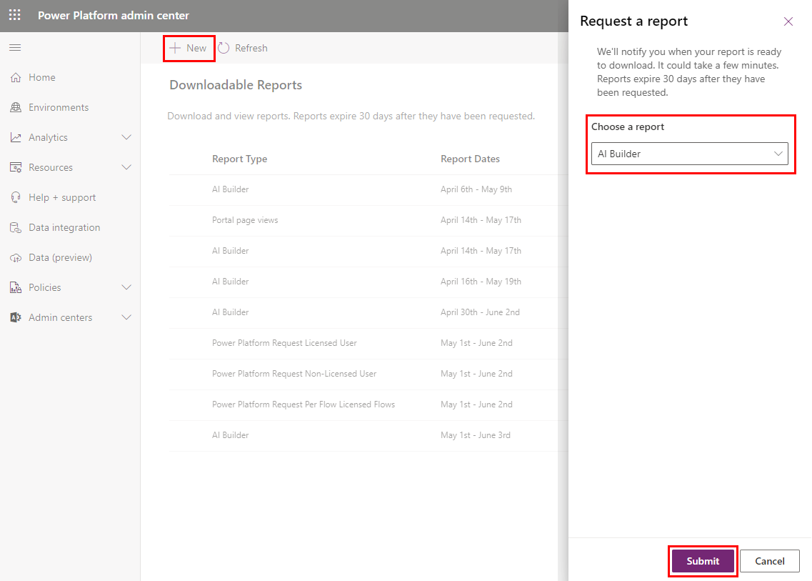
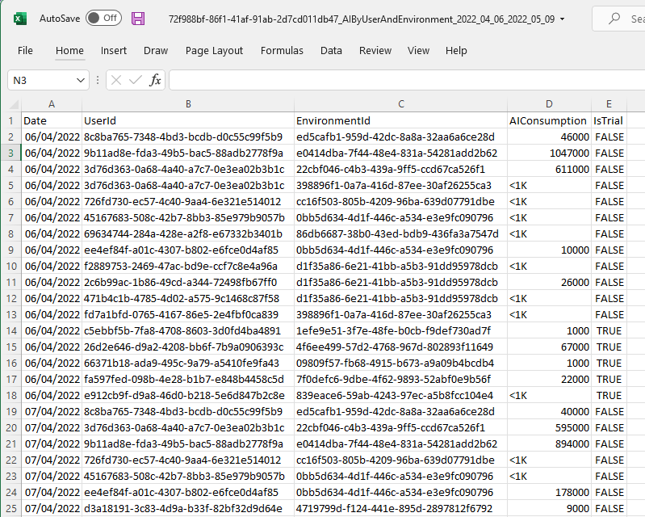

# AI Builder consumption report

AI Builder is licensed as a capacity add-on that must be allocated to a Microsoft Power Platform environment by an administrator. Each AI builder capability consumes credits at a different rate.

- The [AI Builder calculator](https://flow.microsoft.com/ai-builder-calculator/) allows you to perform an assessment of what you need for your business.
- The [AI Builder licensing page](administer-licensing.md) gives you more details on how AI Builder capacity works.

In addition, administrators can download an Excel report that shows the actual capacity consumption in your tenant. The consumption report shows the capacity used in the 30 days preceding the selected target date for each environment. This makes it easier to compare your allocated capacity with the actual capacity consumption of your organization so you can fine tune your capacity allocation.

Consumption reports aren't available in Government Community Cloud (GCC and GCC High).

## View the consumption report

To download and view an Excel file showing your AI credit consumption report:

1. Sign in to the [Power Platform admin center](https://admin.powerplatform.microsoft.com/).

1. On the left pane, select **Resources** > **Capacity**.

1. On the **Summary** tab, select **Download reports** in the **Add-ons** section.

    > [!div class="mx-imgBorder"]
    > 

1. On the menu at the top, select **+New**.

1. In the **Choose a report** dropdown list, select **AI Builder**.

1. Select **Submit**.

    > [!div class="mx-imgBorder"]
    > 

    The **Downloadable Reports** list shows that a new report is being generated.

    > [!div class="mx-imgBorder"]
    > 

1. After the new report is generated, select the report in the list.

1. At the top of the screen, select **Download** to download the report as an Excel file.

## Understanding the consumption report

The report shows AI credits consumed by date for each environment.

 > [!div class="mx-imgBorder"]
 > 

- **UserId** is the identifier visible in the Dataverse "User" table.
- **EnvironmentId** is the identifier visible in your Power Apps or Power Automate URL (for example, https://make.powerapps.com/environments/%GUID%).

- **<1K** in the **AIConsumption** column means that you've consumed fewer than 1,000 credits on that day and that environment.

You can compare the aggregated consumption for the current calendar month on each environment with what has been allocated. Using this information, you can take action to allocate more credits to environments that are in overage. Remember, the number of allocated credits by environment is visible and can be changed in the Power Platform admin center [Add-ons](https://admin.powerplatform.microsoft.com/resources/capacity#add-ons) page.

### See also

- [Microsoft Power Apps and Power Automate Licensing Guide](https://go.microsoft.com/fwlink/?LinkId=2085130) 
- [AI Builder licensing FAQ](/power-platform/admin/powerapps-flow-licensing-faq#ai-builder)

[!INCLUDE[footer-include](includes/footer-banner.md)]
