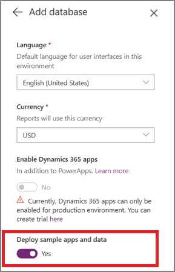

# Build a model in AI Builder

In AI Builder, we guide you through each step to create your AI model.

> [!div class="mx-imgBorder"]
> 

## Prerequisite

AI Builder requires the use of [Microsoft Dataverse](/powerapps/maker/common-data-service/data-platform-intro), which is the data platform for Microsoft Power Platform that allows you to store and manage business data. Dataverse is the platform on which Dynamics 365 apps are built. This means if you're a Dynamics 365 customer, your data is already in Dataverse.

## Deploy sample apps and data

Do you want to explore AI Builder by using sample data provided by Microsoft? Enable the **Deploy sample apps and data** setting when you create your environment to add sample data to your environment automatically. You can also [download sample data](samples.md), and then upload it to your environment.

## Get started

AI Builder allows you to build models based on data type (for example, documents, text, structured data, or images), and build types. The *custom* build type allows you to build, train, and publish a model for use that is unique to your business. The *prebuilt* build type is ready to use, and offers scenarios that are common across different types of businesses.

For more information about data types and build types, go to [AI models and business scenarios](model-types.md).

1. Sign in to [Power Apps](https://make.powerapps.com).

1. In the left pane, select **AI Builder** > **Explore**.

1. Under **Make your own AI model**, select an AI model type.

1. Select a custom model, and then select **Get started**.

## Troubleshooting

Make sure AI Builder has been enabled for your environment. Otherwise, you won't have access to AI Builder functionality.

## Next step

[Train your model in AI Builder](train-model.md)

### See also

[AI Builder actions are disabled/deactivated](/troubleshoot/power-platform/ai-builder/aibuilder-actions-are-disabled-deactivated)
