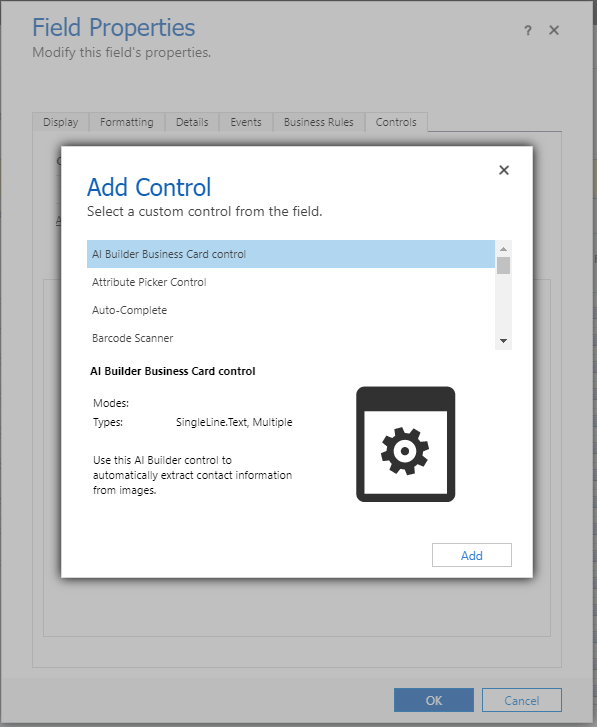
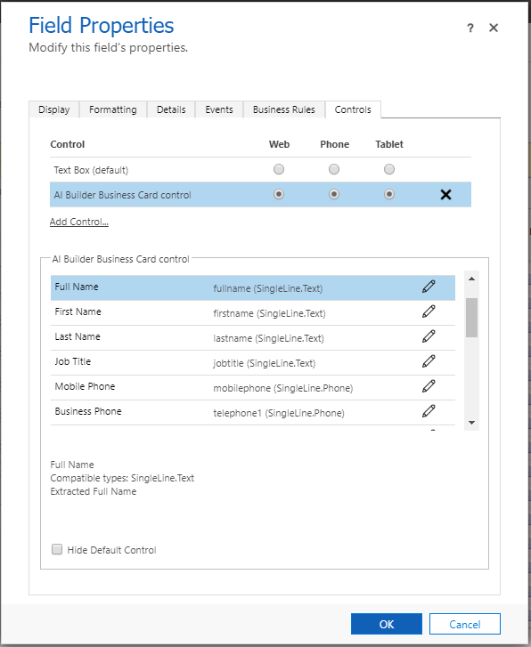

# Use the business card reader in model-driven apps

Use the AI Builder business card reader component to detect business cards, and extract their information. You can take photos directly in the component, or load images that you've taken. Data is identified and extracted using the properties listed below.

For information about model-driven apps, see [What are model-driven apps in Power Apps?](/powerapps/maker/model-driven-apps/model-driven-app-overview)

## Licensing requirements

AI Builder is licensed as an add-on to your Power Apps or Power Automate licenses. For information about license capacity, pricing, and restrictions, see [AI Builder licensing](/ai-builder/administer-licensing).

## Role requirements

You need the **common data service user** role to use the business card reader.

## Add the business card reader

Add the business card reader to a contact or lead form using the form editor, and bind it to a placeholder **SingleLine.Text** or **Multiple** field.

1. Select the placeholder field, and then select **Properties**.
2. Select the **Controls** tab.
3. Select **Add Control**.
4. Select **AI Builder Business Card Control**.

> [!div class="mx-imgBorder"]
> 

## Configure the business card reader

After you select the platform where the business card reader should appear (web, phone, tablet), you can bind the component properties that you need.

> [!div class="mx-imgBorder"]
> 

> [!NOTE]
> - The **Company Name** property can't be bound to a field of type **Lookup.Customer**. The only supported type is **SingleLine.Text**.
> - Find more information about [adding components to model-driven apps](/powerapps/developer/component-framework/add-custom-controls-to-a-field-or-entity).

## Key properties

If a business card is detected, the business card reader will try to extract information that it finds based on the following properties:

|Property |Definition  |Type  |
|---------|---------|---------|
 |**Full Name**| The contact full name| **SingleLine.Text**|
 |**First Name**| The contact first name|**SingleLine.Text**|
 |**Last Name**| The contact last name|**SingleLine.Text**|
 |**Job Title**| The contact job title|**SingleLine.Text**|
 |**Mobile Phone**| The mobile phone number detected| **SingleLine.Phone**|
 |**Business Phone**| The business phone number detected| **SingleLine.Phone**|
 |**Fax**| The fax number detected| **SingleLine.Phone**|
 |**Email**| The contact email found in the business card, if any |**SingleLine.Email**|
 |**Company Name**| The company name|**SingleLine.Text**|
 |**Website**| The website detected| **SingleLine.URL**|
 |**Department**| The organization department found|**SingleLine.Text**|
 |**Full Address**| The contact full address|**SingleLine.TextArea, Multiple**|
 |**Address Street**| The street address detected|**SingleLine.Text**|
 |**Address City**| The city address detected|**SingleLine.Text**|
 |**Address PostalCode**| The postal code address detected|**SingleLine.Text**|
 |**Address Country**| The country address detected|**SingleLine.Text**|
 |**Cleaned Image**| The image after processing where the business card appears cropped and enhanced from the original image|**Multiple**|

## Customization properties

The following properties are available for advanced customization:

<!--from editor: Wondering if "overwrite" might be the correct word for the last line. -->
<!--v-dehaas: I don't think so, although it wouldn't be incorrect. "override the default" makes more sense to me.  -->

|Property |Definition  |
|---------|---------|
 |**Default Image**| To replace the default placeholder image with a different one. The image (JPEG or PNG) should be encoded with base-64 digits.
 |**Text**| To override the default button text.
