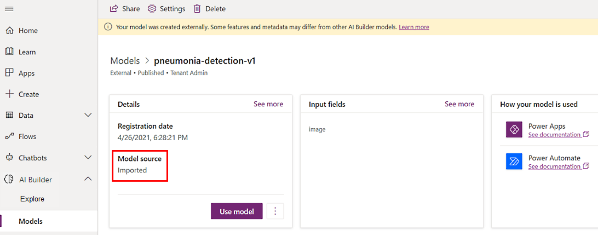

# Bring your own AI model into AI Builder (preview)

[!INCLUDE[cc-beta-prerelease-disclaimer](./includes/cc-beta-prerelease-disclaimer.md)]

You can bring your own model into AI Builder so that it can function like any AI Builder custom model. You can use your model in Microsoft Power Platform by using Power Automate, or you can build apps using Power Apps.

When you use your own model, it's sometimes referred to as a *model endpoint*, which enables communication. When you use your own model, limitations apply. These [limitations](#limitations) are described later in this article.

## Create your own model

Apart from AI Builder, you can create your own model using Azure or any model created on a machine language platform. <!--- Any, or just Azure? -->

To use your own model in AI Builder, it must meet certain requirements:

- You have an existing model that's in any machine language platform with an endpoint.

- Your model contains an API definition (also known as swagger).

- You've registered your model in the AI Builder SDK.

## Register your own model

The first step in bringing your own model into AI Builder is to register it. To register, follow the procedure in [Bring your own model tutorial](https://github.com/microsoft/PowerApps-Samples/tree/master/ai-builder/BringYourOwnModelTutorial) (in GitHub).

Once you register the model, you'll see it in the list of AI Builder models. On the model details page, the **Model source** will be **Imported** to show that the external model is registered to AI Builder using your imported model endpoint.

> [!div class="mx-imgBorder"]
> 

## Limitations

- The only authentication mechanism supported is [API keys](/azure/machine-learning/how-to-authenticate-web-service) using [Azure Machine Learning](/azure/machine-learning/overview-what-is-azure-machine-learning).

- Swagger version 2.0 is supported.

- Maximum allowed batch size is 500 rows.

- Maximum allowed latency/timeout is 20 seconds.

- Open API data types supported are:
   - Integer
   - Number
   - Boolean
   - String

- If your model takes an image as an input in Base64, it can be used for real-time prediction only, for consumption in Power Automate or Microsoft Power Fx (the formula language for canvas apps). Batch prediction isn't supported.
   - The name of the field should end with **image** (case insensitive).
   - The data type should be **String**.

You're now ready to use your own model in AI Builder. You can perform application lifecycle management tasks such as package your model in a solution, import your model into the target environment, and upgrade your model in source/target environments.

### See also

[Application lifecycle management](byom-alm.md)