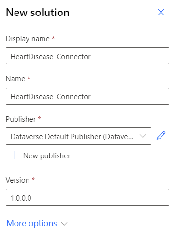
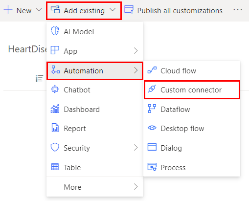
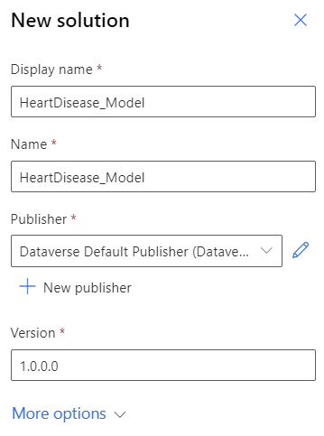

# Application lifecycle management (preview)

[!INCLUDE[cc-beta-prerelease-disclaimer](./includes/cc-beta-prerelease-disclaimer.md)]

Now that you've registered your model in AI Builder, you can perform application lifecycle management (ALM) tasks, such as:

- Package your model in a solution.
- Import your model into the target environment.
- Upgrade your model in source/target environments.

For an overview of ALM, go to [Overview of application lifecycle management](/power-platform/alm/overview-alm). To understand the components, tools, and processes needed to implement ALM, go to [ALM basics](/power-platform/alm/basics-alm).

## Package your own model in a solution

Solutions are used to transport apps and components from one environment to another. They are also used to apply a set of customizations to existing apps.

For solution features, go to [Solutions](/power-platform/alm/basics-alm).

1. Register model into source environment using AI Builder SDK. <!-- is this the same as "To register, follow the procedure in [Bring your own model tutorial](https://github.com/microsoft/PowerApps-Samples/tree/master/ai-builder/BringYourOwnModelTutorial), which is in GitHub.>" from byo0model.md? If so, where do you find RegisterModel.ipynb notebook? -->

1. Create a solution to store the custom connector which is associated with the model:
   1. Select **Solutions** > **New solutions**.
   1. In the **New solution** dialog, complete the fields.
   1. Select **Create**.

   > [!div class="mx-imgBorder"]
   > 

1. Add an existing custom connector by selecting **Add** > **Automation** > **Custom connector**.

   > [!div class="mx-imgBorder"]
   > 

1. Select the custom connector associated with the model. The name will be in this format: \<model_name>-\<random number>-v\<version>.

   The version here helps distinguish which connector to add when updating a model.

   > [!div class="mx-imgBorder"]
   > 

1. Export the solution:
   1. Select **Run** > **Next**. (If the solution isn't yet published, you must select **Publish** first.)
   1. Select **Managed** > **Export**.

1. Create a new solution to add the model and any other components.
   1. Select **Solutions** > **New solutions**.
   1. In the **New solution** dialog, complete the fields.
   1. Select **Create**.

    > [!div class="mx-imgBorder"]
    > 

1. Add an existing connection reference by selecting **Add** > **More** > **Connection Reference (preview)**.

   > [!div class="mx-imgBorder"]
   > 

1. Add the existing connection reference associated with the model. The naming scheme here is the same as the custom connector in step 4: \<model_name>-\<random number>-v\<version>.

   > [!div class="mx-imgBorder"]
   > 

1. Add the AI model by selecting **Add** > **AI Model**.

   Your solution should contain the following components:

   > [!div class="mx-imgBorder"]
   > 

1. (*Optional*) Add any desired components. To do this, repeat steps 6 through 9.

1. Export the solution:
   1. Select **Run** > **Next**. (If the solution isn't yet published, you must select **Publish** first.)
   1. Select **Managed** > **Export**.  

## Import your model into the target environment