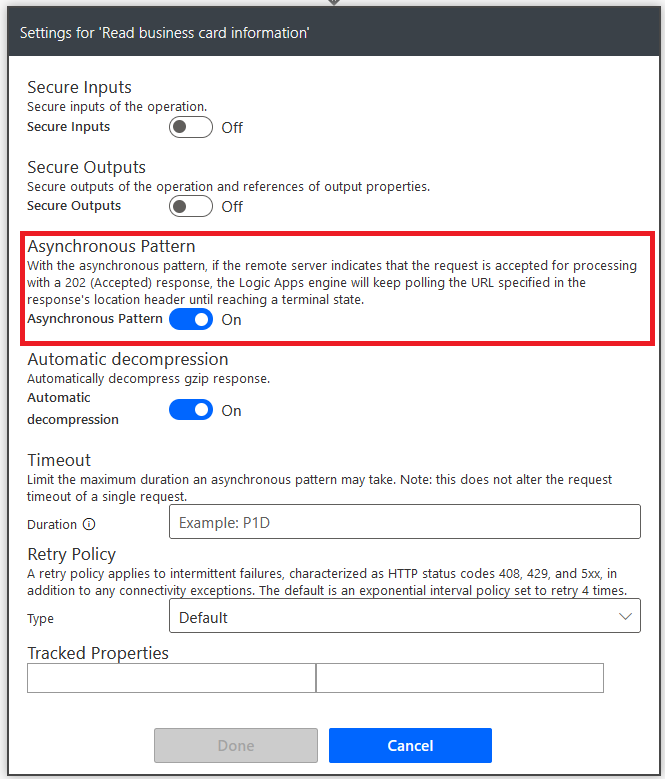
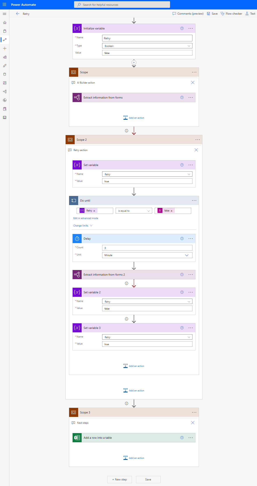
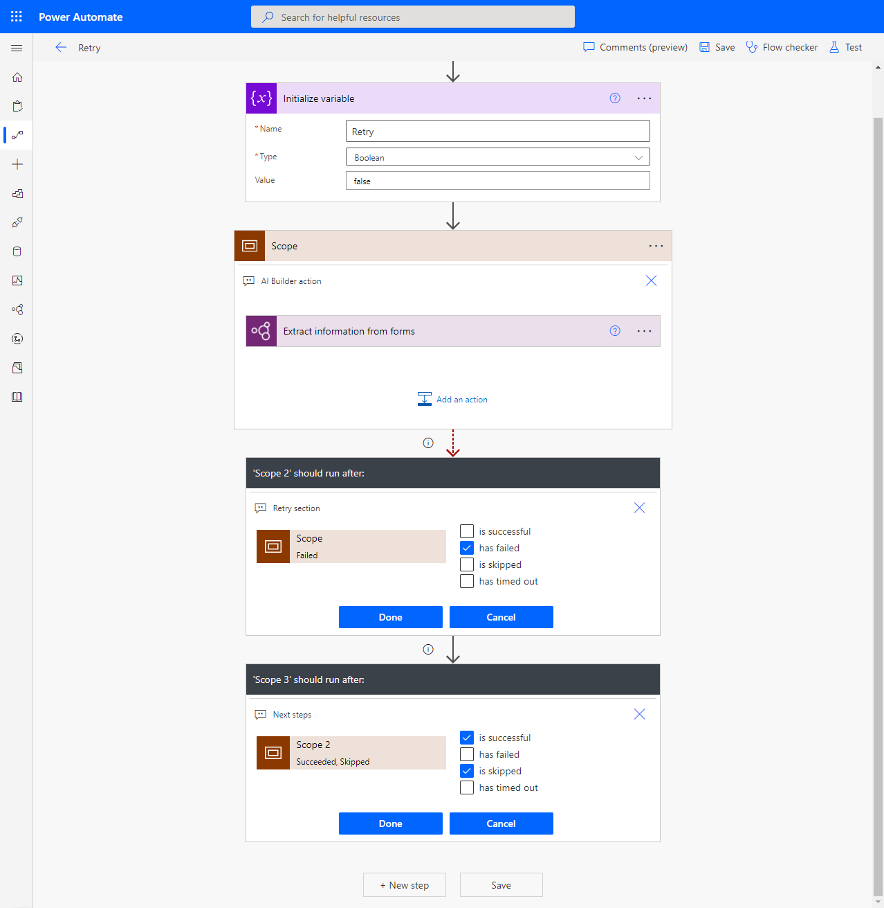
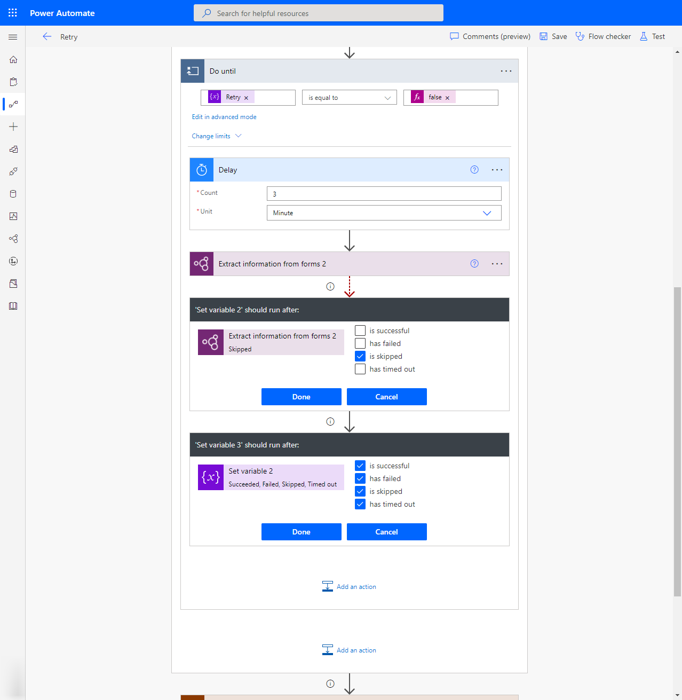

# Common issues and resolutions for AI Builder

Here are some issues that have been found in AI Builder. Where applicable, workarounds are provided.

## AI Builder isn't set up correctly in your environment

AI Builder might not work in some environments created before the release of AI Builder. To work around this issue, [create a new environment](/power-platform/admin/create-environment). If you need to use a particular environment, [contact support](/power-platform/admin/get-help-support) for more options.

## AI Builder gets errors trying to read data from your Microsoft Dataverse table

Go to the data preparation section for your AI model type. Make sure your Dataverse environment is configured correctly so that your model can access it.

## AI Builder business card reader doesn't work for some users

Make sure that users of the business card reader component have access either to Dataverse or to the AI Builder model table configured in the business card reader component.

## Code component removal

This issue can occur with apps where AI Builder components were added using a faulty version of the component. By opening the app, the faulty components are removed. You should add again the AI builder components, solve any mapping issue you may have (renaming the newly added AI builder components with the name you have previously defined for the removed components may solve the mapping issues), then save and publish your app.

## When I scan images using AI Builder components in Power Apps, the output image rotation is wrong

This issue can occur with the Google Chrome browser due to the way this browser handles image orientation. Some images in Power Apps might be rotated differently than you expect when using Chrome. To work around this issue, try a different browser.

## The training document isn't displayed on the form processing model details page

When you create a form processing model, a preview of one of the training documents appears on the model details page after training is completed.

The training document might not appear if:

* You don't have permissions to view training documents.
* You aren't the owner of the model. 
* You imported the model from another environment. When you import a form processing model from another environment, the original training data isn't imported with it. Thus, the document preview can't be displayed.

## Too Many Requests error in Power Automate

If you perform too many executions in a short timeframe on a given model, you might receive this error message: **error: _429 – TooManyRequests_**.

If this error occurs, decrease the concurrency level of your flow. For example, if your flow is triggered by the action "When a file is created in a folder" when using the SharePoint trigger, you can reduce the degree of parallelism in the action settings.

   > [!div class="mx-imgBorder"]
   > 

## The output of an AI Builder action is empty in Power Automate or the next action returns an error "Unable to process template language expressions in action..."

When looking at the output of the AI bulider action, you'll see a json starting with `"statusCode": 202`.
Make sure that the asynchronous pattern is not disabled for this action. If it is disabled, enable it and run your flow again.

   > [!div class="mx-imgBorder"]
   > 

## Dependency Timeout error when using a form processing model in Power Automate

If you get a **Dependency Timeout error (_408 – DependencyTimeout_)** when executing a form processing model in Power Automate, the file you're trying to process might be too large in number of pages or file size. There are a few actions that can be done to improve this:
-	If the file has multiple pages, reduce the document to just the pages you need to process. You can use the **Page range** input in Power Automate to only process the pages you need. For more information, go to [page range](./form-processing-model-in-flow.md#page-range) in Power Automate.
-	Reduce the size of the file.
-	Retry after some time. You can configure in the flow an automatic retry after failure loop. Ensure to leave a certain time delay interval between each execution after a failure. The following illustrations show an example on how to setup a retry logic in a cloud flow. Make sure you set the _'Configure run after'_ settings accordingly. 

   > [!div class="mx-imgBorder"]
   > 

   > [!div class="mx-imgBorder"]
   > 

   > [!div class="mx-imgBorder"]
   > 

## Upload fails for documents and images in form processing, object detection models

If documents or images fail to upload to your form processing or object detection models, it could be because Customer Managed Keys (CMK) is enabled on your tenant. CMK is not currently supported in AI Builder. You have to opt-out of CMK to train form processing or object detection models.  

## The analysis failed for these documents error in form processing 

If you get the error message **_“The analysis failed for these documents”_** when you are creating your form processing model. Make sure that:
* The documents that you have uploaded meet the [following requirements](./form-processing-model-requirements.md).
* If the documents that you have uploaded are PDFs with multiple pages, split the PDF documents with only the pages you need the model to recognize and upload the reduced documents that have been split instead.

## Fields could not be loaded for this document error in form processing 

If you get the error message **_“Fields could not be loaded for this document”_** while you are creating your Form processing model, this can be caused by:
* A temporary error, like poor internet connectivity. You can try again by selecting the **Retry** button.
* The document you are trying to select fields from is too large. If it’s a PDF with multiple pages, split the PDF documents with only the pages you need the model to recognize and upload the reduced document that has been split instead. If it’s an image, reduce its dimensions and upload it to your model to replace the previous image uploaded. 

## Training failed and the model can't be used error in form processing

If you get the error message **_“Training failed and the model cannot be used”_** error in form processing after you have trained your form processing model, this can be caused by:

* A temporary error. You can retry by retraining your model again by selecting **Edit model**.
* The documents that you uploaded for training don’t meet the [Form-processing model requirements](./form-processing-model-requirements.md).

## Pages parameter generates an error when saving a form processing flow
If you get the error message **_“Flow save failed with code 'WorkflowOperationParametersExtraParameter' and message 'The API operation does not contain a definition for parameter 'item/requestv2/pages'.'”_** when saving a form processing flow with **Pages** parameter specified, it means your model needs to be republished.
To solve that issue, go to your model's page in AI Builder, unpublish and republish your model.

## "The current environment doesn’t meet the minimum requirements" error message

The **_“The current environment doesn't meet the minimum requirements”_** error message occurs when the Microsoft Dataverse database in the environment where you are creating your model doesn't have the latest updates installed. To solve this, create a support request in the Power Platform admin center to request that the latest AI Builder updates be installed in your Dataverse database.

Alternatively, you can [create a new Power Platform environment with a database](/power-platform/admin/create-environment#create-an-environment-with-a-database), which will have the latest updates.

## AI Builder actions are disabled/deactivated

AI Builder can't be used if its actions have been deactivated. To activate them, the administrator of the environment needs to perform the following steps:

1.	Sign in to the [Power Platform admin center](https://admin.powerplatform.microsoft.com/).
2.	Select the environment where the actions are deactivated and select **Settings** > **Resources** > **All legacy settings**.
3.	Select **Processes** from the **Settings** menu.
4.	Select to display **All Processes** and activate all the following AI Builder processes:
    - IsPaiEnabled
    - Predict
    - PredictionSchema
    - Train
    - QuickTest
    - BatchPrediction
    - ScheduleTraining
    - SchedulePrediction
    - ScheduleRetrain
    - UnschedulePrediction
    - UnscheduleTraining
    - CancelTraining
    - PublishAIConfiguration
    - UnpublishAIConfiguration

## AI Builder processes and plug-in steps are turned off in default solution

AI Builder can't be used if its plug-in steps and processes have been turned off.

1. To turn them on, sign in to [Power Apps](https://make.powerapps.com), and select the appropriate environment from the top-right corner.
2. In the left pane, select **Solutions**. 
3. Select **Default Solution**, then select **Edit**.
4. On the left list, select **Plug-in steps**, and ensure all listed steps are turned on:
    - PreValidate: AlmHandler. (required for import/export).
    - PreValidate: isPaiEnabled. 
    - ValidateAIConfiguration
    - PostOperation: CancelTraining
    - PostOperation: PublishAIConfiguration
    - PostOperation: PublishAIConfiguration Async
    - PostOperation: ScheduleRetrain
    - PostOperation: ScheduleTraining
    - PostOperation: Train
    - PostOperation: UnpublishAIConfiguration
    - PostOperation: UnscheduleTraining
    - all the Microsoft.Dynamics.AI.Plugins
    
    These must show the status as **On**. You can select the ones that are turned off, right-click and then **Turn On**.

4. In the left pane, select **Processes**.
5. Select **AlmHandler**, and then select **Turn On**.
6. Select **IsPaiEnabled**, and then **Turn On**.
7. Additionally, check all those processes that are required for AI Builder to ensure they are turned on:
    - AlmHandler
    - AnalyzeSentiment
    - BatchPrediction
    - CancelTraining
    - CategorizeText
    - DetectLanguage
    - ExtractKeyPhrases
    - ExtractTextEntities
    - GetJobStatus
    - IsPaiEnabled
    - Predict
    - PredictByReference
    - PredictionSchema
    - PublishAIConfiguration
    - QuickTest
    - RecognizeText
    - SchedulePrediction
    - ScheduleRetrain
    - ScheduleTraining
    - Train
    - UnpublishAIConfiguration
    - UnschedulePrediction
    - UnscheduleTraining
    - ValidateAIConfiguration

## AI models fail to be imported in a new environment
If your AI models are in error state after importing them in a new environment, here is a sequence of actions you can try to resolve the issue:
- Uninstall the solution containing the model(s).
- If your solution is unmanaged, manually delete the models in the AI Builder model page.
- Reinstall the solution containing the model(s).
- Wait for the end of the "Importing" state for each model.

If the problem persists (no new model gets fixed by this sequence), contact the support team.

## AI Builder form processing is not extracting tables that span across multiple pages
Support for extracting tables that span across multiple pages is currently experimental. Experimental features aren't meant for production usage and have restricted functionality; therefore, we can't provide support for experimental features. To learn more, go to the [latest guidance regarding multipage tables support in AI Builder today](./form-processing-multipage.md).

### See also

- [Get support for AI Builder](support.md)

[!INCLUDE[footer-include](includes/footer-banner.md)]
