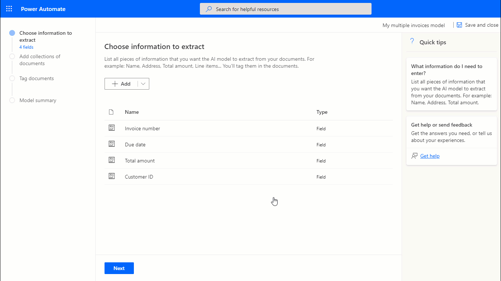
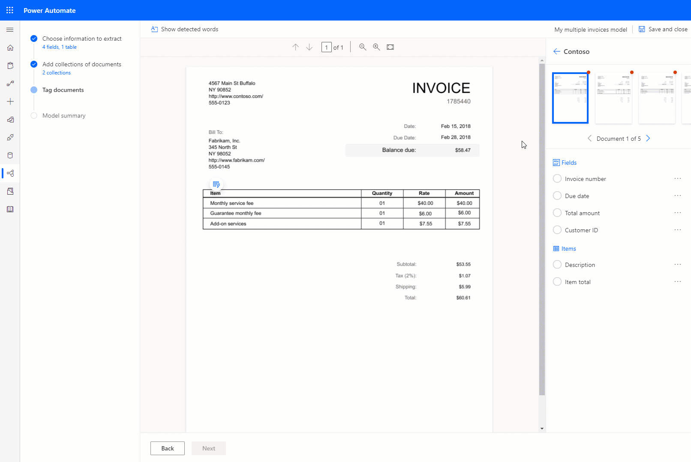
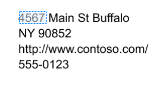

# Create a form processing model

After you review the [requirements](form-processing-model-requirements.md), you can get started creating your form-processing model.

## Sign in to AI Builder

1. Sign in to [Power Apps](https://make.powerapps.com/) or [Power Automate](https://flow.microsoft.com/signin).
1. In the left pane, select **AI Builder** > **Build**.
1. Select **Form processing**.
1. Type a name for your model.
1. If you want to create your model by using your own documents, make sure that you have at least five examples that use the same layout. Otherwise, you can use sample data to create the model.
1. Select **Create**.

## Define fields and tables to extract

On the **Choose information to extract** screen, type the names of the fields and tables you want to teach your model to extract. Select the **Fields** and **Tables** tabs to switch between adding fields or tables.

- To add fields, type the name for each type of field, and select the plus sign **+** to add it.

   > [!div class="mx-imgBorder"]
   > 

- To add tables, type a name for the table, and define the columns you want the model to extract.

   > [!div class="mx-imgBorder"]
   > 

## Group documents by collections (Preview)

A collection is a group of documents that share the same layout. Create as many collections as document layouts that you want your model to process. For example, if you are building an AI model to process invoices from two different vendors, each having their own invoice template, create two collections.

   > [!div class="mx-imgBorder"]
   > 

For each collection that you create, you need to upload at least five sample documents per collection. Files with formats JPG, PNG, and PDF files are currently accepted.

   > [!div class="mx-imgBorder"]
   > 

> [!NOTE]
> The functionality of having more than one collection in an AI model is currently in preview. This means:
>- It is on track to become a permanent part of the product, but we don’t guarantee an SLA expected for GA functionalities. 
>- A form processing model that has more than one collection, cannot be currently exported to another environment via a solution.
>
>If you face any issues while using this feature, report it here: [AI Builder community forums](https://powerusers.microsoft.com/t5/AI-Builder/bd-p/AIBuilder1).

### Analyze

During the analysis, AI Builder examines the documents that you uploaded and detects the fields and tables in your documents. The time it takes to complete this operation depends on the number of documents provided. Usually, it only takes a few minutes.

Once the analysis is complete, you will tag the uploaded documents.

## Tag documents

By tagging the documents you have uploaded, you are teaching your AI Builder model to extract the fields and tables you have specified.

To start tagging, select one of the collections on the right panel.

### Tag fields

To tag a field, simply draw a rectangle around the field you're interested in and select to the field name that it corresponds to.

   > [!div class="mx-imgBorder"]
   > 

At any time you can resize to adjust your selection.

When you hover over words in your documents, light blue boxes may appear. These indicate that you can draw a rectangle around those words to select a field.

   > [!div class="mx-imgBorder"]
   > 

### Tag tables

AI Builder can detect tables in your documents. These are indicated by a rounded table button on the upper left of the table. When you select it, you have the possibility to preview the content detected by the table as well as tag the table.

When you select **Tag table**, you will need to tag the columns that you defined by selecting them on the document. 

   > [!div class="mx-imgBorder"]
   > 

> [!NOTE] 
> **Current limitations with tables**
>
> Drawing tables that haven't been automatically detected isn't currently supported. If you defined a table that is not automatically detected, you will need to mark it as **not available** to continue. 
>
> For AI Builder to detect tables, rows and columns need to be clearly delimited and be properly aligned. Nested tables and merged headers are not currently supported.

### Field or table not in document

If a field or table is not present in one of the documents you have uploaded for training, just use the not available in document option on the right-side panel next to a field or table.

   > [!div class="mx-imgBorder"]
   > 

## Tag all documents across all collections

All the documents that you have uploaded are presented for you to tag. Some of the fields might be automatically detected in successive documents. In that case confirm that the selection is correct.

If you have created multiple collections, tag all documents across all the collections.

### Next step

[Train and publish your form processing model](form-processing-train.md)

[!INCLUDE[footer-include](includes/footer-banner.md)]