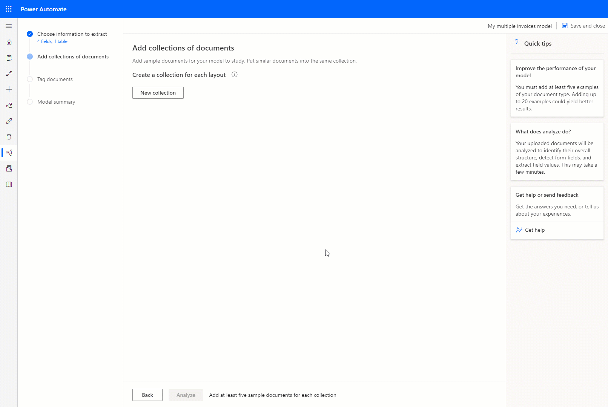
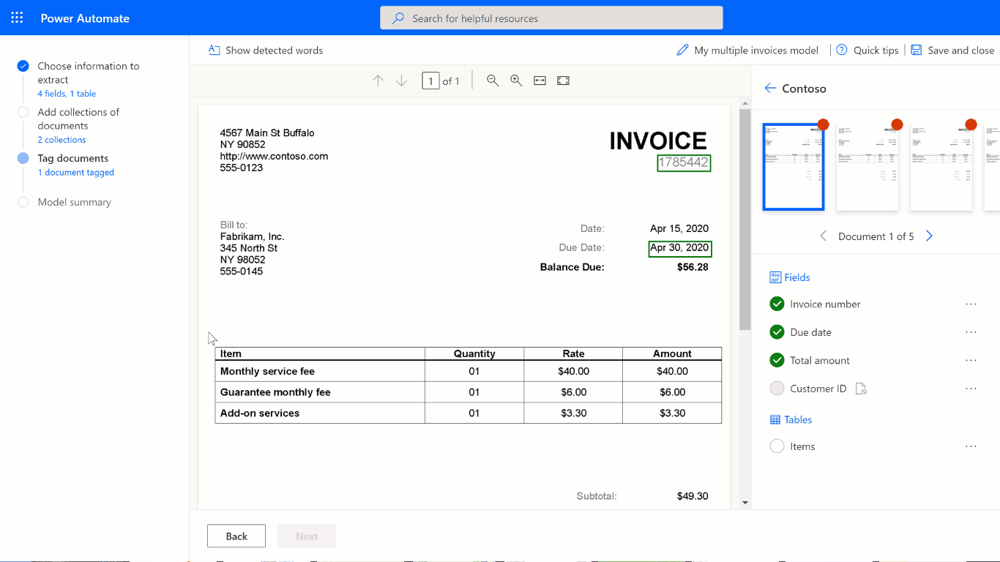
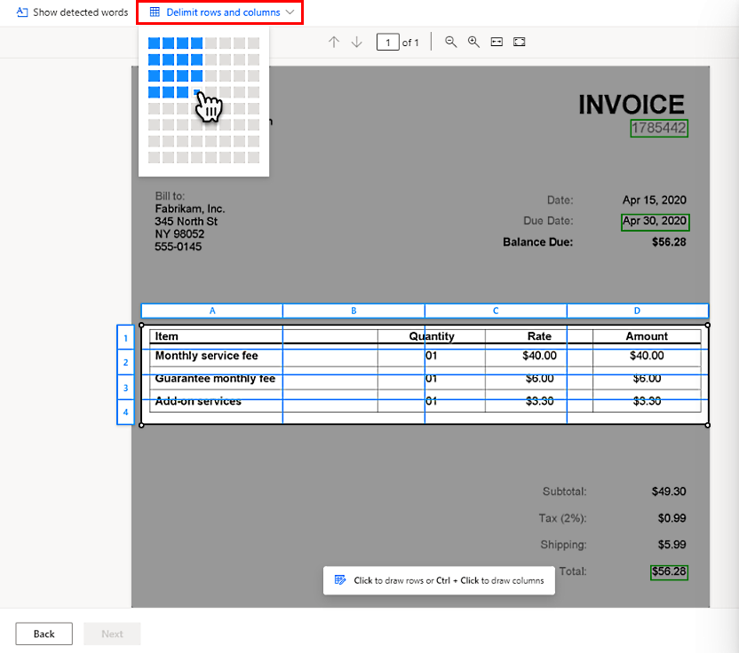
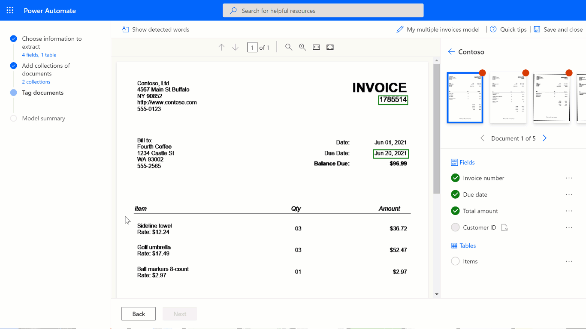

# Create a form processing custom model

After you review the [requirements](form-processing-model-requirements.md), you can get started creating your form processing model.

## Sign in to AI Builder

1. Sign in to [Power Apps](https://make.powerapps.com/) or [Power Automate](https://flow.microsoft.com/signin).
1. In the left pane, select **AI Builder** > **Build**.
1. Select **Form processing**.
1. Type a name for your model.
1. If you want to create your model by using your own documents, make sure that you have at least five examples that use the same layout. Otherwise, you can [use sample data](form-processing-sample-data.md) to create the model.
1. Select **Create**.

## Define fields and tables to extract

On the **Choose information to extract** screen, you define the fields and tables you want to teach your model to extract. Select the **+Add** button to start defining fields and tables.

- For each field, provide a name you would like the field to have in the model.

   > [!div class="mx-imgBorder"]
   > 

- For each table, provide the name you would like the table to have. Also, define the different columns that the model should extract.

   > [!div class="mx-imgBorder"]
   > 

## Group documents by collections

A collection is a group of documents that share the same layout. Create as many collections as document layouts that you want your model to process. For example, if you're building an AI model to process invoices from two different vendors, each having their own invoice template, create two collections.

   > [!div class="mx-imgBorder"]
   > 

For each collection that you create, you need to upload at least five sample documents per collection. Files with formats JPG, PNG, and PDF files are currently accepted.

   > [!div class="mx-imgBorder"]
   > 

## Tag documents

By tagging the documents you've uploaded, you're teaching your AI Builder model to extract the fields and tables you've specified.

To start tagging, select one of the collections on the right panel.

### Tag fields

To tag a field, draw a rectangle around the field you're interested in and select to the field name that it corresponds to.

   > [!div class="mx-imgBorder"]
   > 

At any time, you can resize to adjust your selection.

When you hover over words in your documents, light blue boxes may appear. These indicate that you can draw a rectangle around those words to select a field.

   > [!div class="mx-imgBorder"]
   > 

### Tag a table with a mouse

1. Draw a rectangle around the table in the document you're interested in, and then select the table name that it corresponds to. The content of the panel on the right will change.

1. Draw *rows* by left-clicking between row separators.

1. Draw *columns* by pressing **Ctrl** + left-click.

1. Once the rows and columns have been set, assign the headers to extract by selecting the header column and mapping it to the desired one.

1. A preview of how the table will be extracted appears on the panel on the right.

1. If the header of the table has been tagged, select **Ignore first row** so the header of the table isn't extracted as the table content.

The following animation illustrates the process:

   > [!div class="mx-imgBorder"]
   > 

### Tag a table with an alternative pointing device

An alternative way to define the rows and columns for a table is by selecting **Delimit rows and columns** at the top of the screen.

   > [!div class="mx-imgBorder"]
   > 

### Use the advanced tagging mode

Advanced tagging mode allows you to tag tables at the cell level. Use this mode for complex tables like:

- Tables that are skewed, where tagging with a grid is not possible.
- When you need to extract nested items, like an item within a cell. 

Given the table from the example below, to extract the unit price, we will define it as a separate column on the [Choose information to extract step](create-form-processing-model.md#define-fields-and-tables-to-extract). We define **Description**, **Unit price**, **Quantity**, and **Amount** each as a column of the table and tag them accordingly using advanced tagging mode. See the animation below.

   > [!div class="mx-imgBorder"]
   > 

You can start tagging in the default mode to quickly capture all rows and columns. Then switch to advanced mode to adjust each cell and tag nested items.

### Multipage tables

AI Builder doesn’t currently support extracting tables that span across multiple pages as a single table. To extract tables from different pages, these will need to be defined as separate tables in the [Choose information to extract step](create-form-processing-model.md#define-fields-and-tables-to-extract). For example, if you have a document with a table that spans over two pages, you'll need to define them as two separate tables.

### Field or table not in document

If a field or table isn't present in one of the documents you've uploaded for training, select **Not available in document** on the panel to the right, next to a field or table.

   > [!div class="mx-imgBorder"]
   > 

## Tag all documents across all collections

All the documents that you've uploaded are presented for you to tag. Some of the fields might be automatically detected in successive documents. In that case confirm that the selection is correct.

If you've created multiple collections, tag all documents across all the collections.

### Next step

[Train and publish your form processing model](form-processing-train.md)

[!INCLUDE[footer-include](includes/footer-banner.md)]
