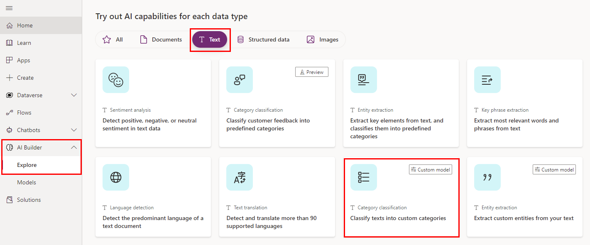

# Create a category classification custom model

Now that you have your training data in Microsoft Dataverse, you can create a new model and configure it.

1. Sign in to [Power Apps](https://make.powerapps.com/), and then select **AI Builder** > **Explore**.

1. Select **Text**.

1. Select **Category classification - Classify texts into custom categories**. 

    > [!div class="mx-imgBorder"]
    > 

1. Read the **Classify texts into custom categories** page, and then select **Get started**.

1. Choose **Select text**, select the table, select the column where your training text is stored, and then choose **Select column**.

1. Select **Next**.

1. Choose **Select tags**, select the column where the tags are stored, and then choose **Select column**.

1. (If not pre-selected) Select the separator you used for your tags, and then select **Next**.

1. Review your text and tags to verify the data and the configuration you applied, and then select **Next**.

1. Select the language you want to use for training, and then select **Next**.

That's it! Now you can train your AI model.

### Next step

[Train your category classification model](train-text-classification-model.md)

[!INCLUDE[footer-include](includes/footer-banner.md)]
