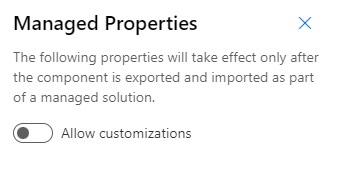

# Distribute your AI model

You can distribute an AI model as a *solution component*. After you create a model in AI Builder, make it available for other environments to use. Do this by packaging it into a solution, and then exporting it into a zip file. After the solution is imported in the target environment, the packaged AI model is available for use.

For more information, go to [Introduction to solutions](/powerapps/developer/common-data-service/introduction-solutions).

## Solution explorer

Use the Power Apps solution explorer to create solutions and add components&mdash;such as AI models&mdash;to them. You can also export and import solutions by using the solution explorer.

For more information, go to [Use solutions in Power Apps](/powerapps/maker/common-data-service/use-solution-explorer).

## Recommended process

It's a good idea for you to develop AI models in a sandbox or development environment first. Then, you can deploy them to a production environment with managed solutions. If you need to copy your production environment into a sandbox environment, follow the instructions in [Copy an environment](/power-platform/admin/copy-environment).

Using this process, you can use the model immediately after you import it. No other action is required to use it in Power Apps or Power Automate, but it's a good idea to perform a quick test in AI Builder first.

A model can only be added in a solution when it has a published version. When the solution is exported and imported in a new environment, only the published version of the model is installed in the new environment.

> [!NOTE]
> When adding an AI model in a solution, only the model executable is included. The training data isn't included with the model.

## Automating the process

As AI models can be distributed across environments using solutions, you can automate your model lifecycle in the same way you would for other platform components. To learn more, go to
 [Application lifecycle management (ALM) with Microsoft Power Platform](/power-platform/alm).

## Changing imported models
Generally, we don't recommend changing imported models because it generates unmanaged customizations. These customizations can prevent the model from being properly updated in the future. Changes include updating model information, creating and training new versions, or republishing the model.

For some models, creating and training new versions have been disabled because training data isn't moved alongside the model. This applies to document processing, object detection, and entity extraction models.

If you accidentally perform actions after you've imported, delete the imported solution and then import the solution again.

To avoid accidental modification of a model after import, it might be a good idea to disable customization in the managed properties of the model before importing it.

To disable customizations, do the following:

1. From within the solution on the menu at the top, select **Managed Properties**.

1. Turn off **Allow customizations**.

    > [!div class="mx-imgBorder"]
    > 

After you've disabled customization, your model will include a note that you have limited the possible actions to it.

## Importing status
For document processing and object detection models, the import process might continue after the import action is finished. When a model is continuing the import process, **Importing** appears on the list page of the AI Builder model. This is normal and can last several minutes.

## Limitations

- Document processing models where **Unstructured documents and free-form documents** has been selected as document type can't be exported while the functionality is in [preview](overview.md).

- You can't create and train a new version of an imported document processing, object detection, or entity extraction model because the training dataset isn't part of the imported solution. You should create a new model instead.

- You can’t set a run schedule on imported category classification models.

- Importing an object detection model or document processing model should be done within one month of export. However, you can still import after that period if the source model remains unchanged after its export.

- If you're using a model within an app or a Power Automate flow, you need to explicitly add the app and the model to the solution. The model isn't considered an app or flow dependency.

- You can't create a new AI Builder model in solution explorer.

- Only models trained after April 2, 2020, can be added to a solution.
