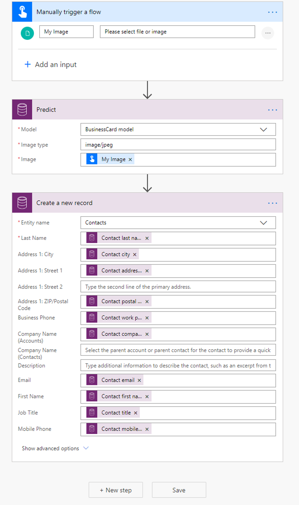

# Use the business card reader prebuilt model in Power Automate

> [!IMPORTANT]
 > To use AI Builder models in Power Automate, you have to create the flow inside a solution. The steps below won't work if you don't follow these instructions first: [Create a flow in a solution](/flow/create-flow-solution).

1. Sign in to [Power Automate](https://flow.microsoft.com/signin), select the **My flows** tab, and then select **Create from blank**.

1. Search for the term **manually**, select  **Manually trigger a flow** in the list of triggers, and then select **+ Add an input**.

1. Select **File**, and enter **My Image** as the input title.

1. Select **+ New step**, search for the term **Predict**, and then select **Predict - Common Data Service (Current Environment)**  in the list of actions.
    >[!NOTE]
    > **Predict Common Data Service (current Environment)** doesn't appear unless you've followed these instructions first: [Create a flow in a solution](/flow/create-flow-solution).

1. Select the **BusinessCard model**, and select one of the following under **Image type**:
    - image/jpeg
    - image/png
    - image/bmp

1. Specify the **My Image** field from the trigger in the image input for your flow.

Congratulations! You've created a flow that uses the business card reader AI model. Select **Save** in the upper-right corner, and then select **Test** to try out your flow.

This procedure should give you the basis from which to continue building a flow that suits your needs. The following example shows a new contact being created in Common Data Service using the business card data.

