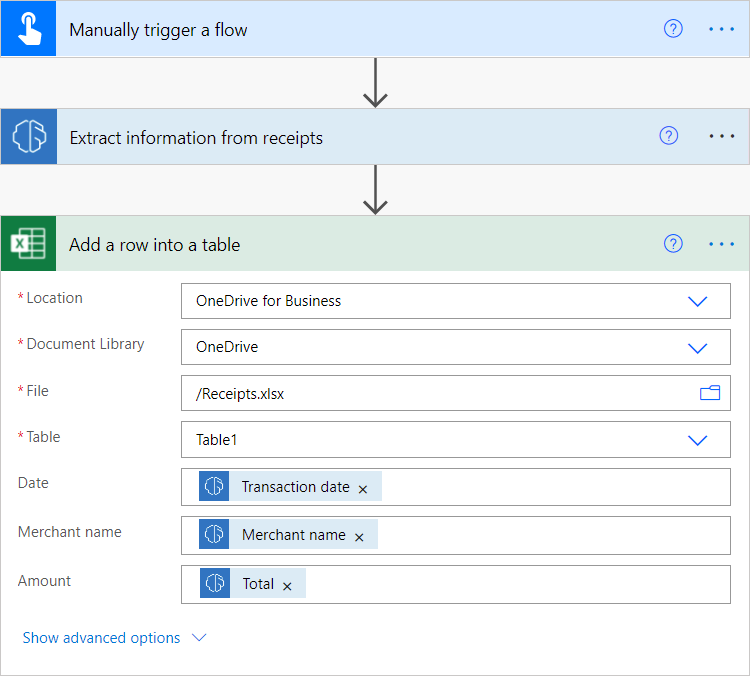
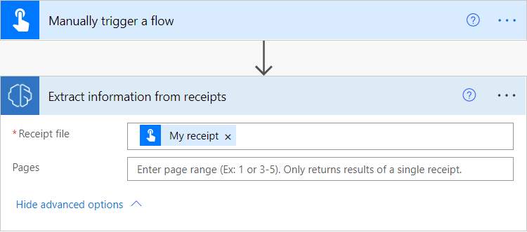

# Use the receipt processing prebuilt model in Power Automate

1. Sign in to [Power Automate](https://flow.microsoft.com/).

1. Select **My flows** in the left pane, and then select **New flow** > **Instant cloud flow**.

1. Name your flow, select **Manually trigger a flow** under **Choose how to trigger this flow**, and then select **Create**.

1. Expand **Manually trigger a flow**, and then select **+Add an input** > **File** as the input type.

1. Replace  **File Content** with **My receipt** (also known as the title).

1. Select **+New step** > **AI Builder**, and then select **Extract information from receipts** in the list of actions.

1. Select the **Receipt file** input, and then select **My receipt** from the **Dynamic content** list:

    > [!div class="mx-imgBorder"]
    > 

1. In the successive actions, you can use any of the receipt values from the [model output](#output) section below.

    > [!div class="mx-imgBorder"]
    > 

>[!NOTE]
> Receipt values are returned as strings. To manipulate them as numbers, you can use the [float](/azure/logic-apps/workflow-definition-language-functions-reference#float) or [int](/azure/logic-apps/workflow-definition-language-functions-reference#int) conversion functions.

Congratulations! You've created a flow that uses the AI Builder receipt processing model. Select **Save** on the top right, and then select **Test** to try out your flow.

## Page range

For large documents, it's possible to specify the page range to process.

   > [!div class="mx-imgBorder"]
   > 

You can enter a page value or page range in the **Pages** parameter. Example: 1 or 3-5.

>[!NOTE]
> If you have a large document with only one receipt, we strongly recommend to **use the Pages parameter to aim at your receipt, and therefore reduce the cost of model prediction and increase performance**. However, note that only the data of the **first receipt** within the page range will be returned and that multi-page receipts are not supported. 
> 
> Example: A document contains a first receipt in page 2 and a second receipt that spans overs page 3 and 4:
> - If you enter value 2, it will return the data of the first receipt
> - If you enter value 3-4, it will only return the data of the first page of the second receipt
> - If you enter value 2-4, it will only return data of the first receipt, not the data of the second receipt

## Parameters
### Input
|Name|Required|Type|Description|
|---------|---------|---------|---------|
|**Receipt file**|Yes|string|The receipt file to process|
|**Pages**|No|string|Page range to process|

### Output
|Name|Type|Description|
|---------|---------|---------|
|**Merchant name**|string|Merchant name|
|**Merchant address**|string|Merchant address|
|**Merchant phone number**|string|Merchant phone number|
|**Transaction date**|string|Transaction date|
|**Transaction time**|string|Transaction time|
|**Purchased item name**|string|Purchased item name. Returned as a part of a list of items.|
|**Purchased item quantity**|string|Purchased item quantity. Returned as a part of a list of items.|
|**Purchased item price**|string|Purchased item price. Returned as a part of a list of items.|
|**Purchased item total price**|string|Purchased item total price. Returned as a part of a list of items.|
|**Subtotal**|string|Subtotal|
|**Tax**|string|Tax|
|**Tip**|string|Tip|
|**Total**|string|Total|
|**Confidence of merchant name**|float|How confident the model is in its detection|
|**Confidence of merchant address**|float|How confident the model is in its detection|
|**Confidence of merchant phone number**|float|How confident the model is in its detection|
|**Confidence of transaction date**|float|How confident the model is in its detection|
|**Confidence of transaction time**|float|How confident the model is in its detection|
|**Confidence of purchased item name**|float|How confident the model is in its detection. Returned as a part of a list of items.|
|**Confidence of purchased item quantity**|float|How confident the model is in its detection. Returned as a part of a list of items.|
|**Confidence of purchased item price**|float|How confident the model is in its detection. Returned as a part of a list of items.|
|**Confidence of purchased item total price**|float|How confident the model is in its detection. Returned as a part of a list of items.|
|**Confidence of subtotal**|float|How confident the model is in its detection|
|**Confidence of tax**|float|How confident the model is in its detection|
|**Confidence of tip**|float|How confident the model is in its detection|
|**Confidence of total**|float|How confident the model is in its detection|
|**Detected text**|string|Line of recognized text. Returned as a part of a list of text.|
|**Page number of detected text**|integer|Which page the line of recognized text is found on. Returned as a part of a list of text.|
|**Height of detected text**|float|Height of the line of text. Returned as a part of a list of text.|
|**Left position of detected text**|float|Left position of the line of text. Returned as a part of a list of text.|
|**Top position of detected text**|float|Top position of the line of text. Returned as a part of a list of text.|
|**Width of detected text**|float|Width of the line of text. Returned as a part of a list of text.|

### Related topics

[Receipt processing overview](prebuilt-receipt-processing.md)

[!INCLUDE[footer-include](includes/footer-banner.md)]
