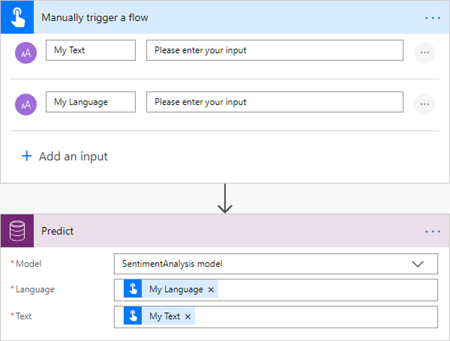
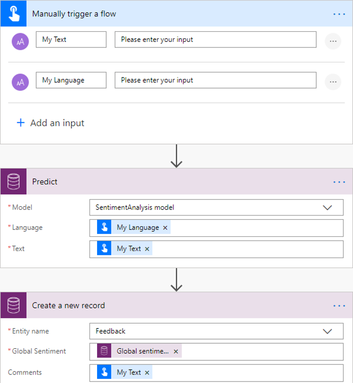

# Use the sentiment analysis prebuilt model in Power Automate

## Create a flow that uses the AI Builder sentiment analysis prebuilt model

> [!IMPORTANT]
 > To use AI Builder models in Power Automate, you have to create the flow inside a solution. The steps below won't work if you don't follow these instructions first: [Create a flow in a solution](/flow/create-flow-solution).

1. [Sign in](https://flow.microsoft.com/signin) to Power Automate, select the **My flows** tab, and then select **Create from blank**.

1. Search for the term *manually*, select **Manually trigger a flow** in the list of triggers, and then select **+ Add an input**.

1. Select **Text**, and set as input title: **My Text**.

1. Select **+Add an input** again.

1. Select **Text** and set as input title: *My Language*.

1. Select **+ New step**, search for *Predict*, and then select **Predict Common Data Service (current Environment)** in the list of actions.
 >[!NOTE]
 > **Predict Common Data Service (current Environment)** doesn't appear unless you've followed these instructions first: [Create a flow in a solution](/flow/create-flow-solution).

1. Select **SentimentAnalyses model**.

1. Specify the **My Language** field from the trigger in the Language input, and the **My Text** field in Text input.
   > 

Now you can use the sentiment properties detected by the sentiment analysis model. In the following example, we set the Sentiment property to a new Common Data Service record.

Congratulations! You've created a flow that uses a sentiment analysis model. Select **Save** in the upper-right corner, and then select **Test** to try out your flow.

## Use sentiment analysis to analyze incoming Dynamics emails

Power Automate provides a template that enables you to analyze incoming Dynamics emails using AI Builder sentiment analysis. This template requires some customization of your Common Data Service email entity before you can use it.

1. Create an attribute in your Email Messages entity in which to save the sentiment analysis results.

   For information about how to create an attribute, go to: [Create and edit fields for Common Data Service using Power Apps portal](https://microsoft.sharepoint.com/powerapps/maker/common-data-service/create-edit-field-portal).

1. [Sign in](https://flow.microsoft.com/signin) to Power Automate.
1. In the left-side navigation pane, select **Templates**, and then search for *AI Builder sentiment*.
1. Select **Analyze sentiment of Dynamics emails using AI Builder**.
1. Select your environment, then type **Email Messages** in the **Entity Name** field, and type **Organization** in the **Scope** field.

   > 

1. Next, the template shows messages from **draft emails** and **received emails**. You can filter these if you want to perform sentiment analysis only on selected email statuses. Status codes can be found here: [email EntityType](/dynamics365/customer-engagement/web-api/email?view=dynamics-ce-odata-9).
1. Select **Add sentiment to CDS Email Entity**, select **Show advanced options**, and then locate the attribute you added in step 1.
1. Finally, add **Global sentiment** from the **Dynamic content** list.

   > 

If you want this field to be visible in your email grid view, follow these steps:

1. Navigate to view\form designer, and add the custom field you created in prerequisite step. For information about how to add the column to your view, go to: [Add a column to your view](/dynamics365/customerengagement/on-premises/customize/create-edit-views-app-designer#add-a-column-to-your-view)

1. Then add a field to form by referring to these instructions: [Add a field to a form](/dynamics365/customerengagement/on-premises/customize/add-field-form)
