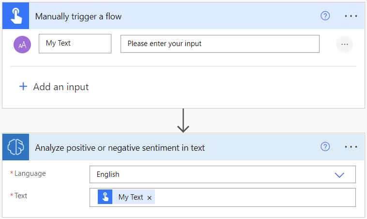
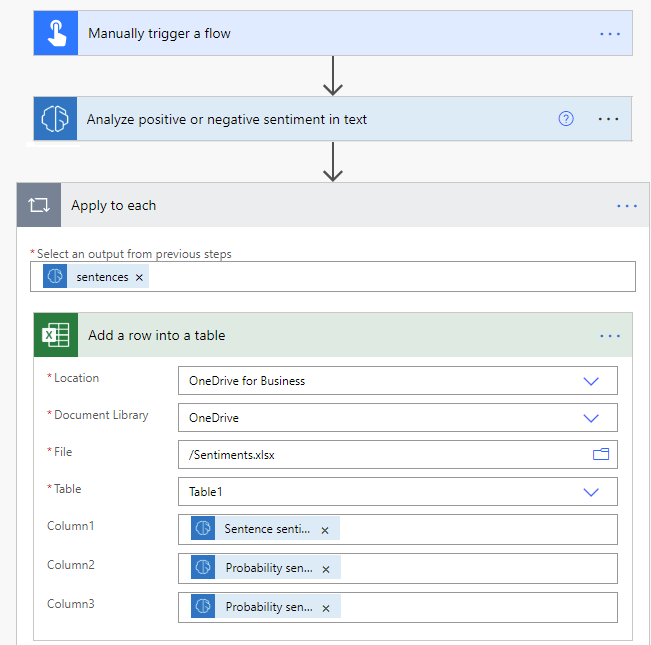

# Use the sentiment analysis prebuilt model in Power Automate

> [!IMPORTANT]
 > To use AI Builder models in Power Automate, you have to create the flow inside a solution. The steps below won't work if you don't follow these instructions first: [Create a flow in a solution](/flow/create-flow-solution).

1. Sign in to [Power Automate](https://flow.microsoft.com/), select the **My flows** tab, and then select **New > +Instant-from blank**.
1. Name your flow, select **Manually trigger a flow** under **Choose how to trigger this flow**, and then select **Create**.
1. Expand **Manually trigger a flow**, select **+Add an input**, select **Text** as the input type, and set as input title **My Text**.
1. Select **+ New step**, search for the term **AI Builder**, and then select **Analyze positive or negative sentiment** in text in the list of actions.
1. Select the language in the **Language** input and specify the **My Text** field from the trigger in the **Text** input:

    > [!div class="mx-imgBorder"]
    > 

1. In the successive actions, you can use any fields extracted by the AI Builder model. For example, you can add lines to an Excel file for each sentence using **Sentence sentiment**, **Probability sentence is positive** and **Probability sentence is negative**:

    > [!div class="mx-imgBorder"]
    > 

Congratulations! You've created a flow that uses a sentiment analysis model. Select **Save** on the top right and then select **Test** to try out your flow.

## Parameters
### Input
|Name |Mandatory |Description |Values |
|---------|---------|---------|---------|
|Text |Yes |Text to analyze |Text sentences |
|Language |Yes |Language of the text to analyze | Item in a list of predefined languages or a language code (ex.: "en", "fr", "zh_chs", "ru")

### Output
|Name |Description |Values |
|---------|---------|---------|
|Overall text sentiment |Overall sentiment of the analyzed text|Positive, neutral or negative |
|Probability overall text is positive |Probability of the positive sentiment in the analyzed text|Value in the range of 0 to 1. Values close to 1 indicate greater confidence that the identified sentiment is accurate |
|Probability overall text is negative |Probability of the negative sentiment in the analyzed text|Value in the range of 0 to 1. Values close to 1 indicate greater confidence that the identified sentiment is accurate |
|Probability overall text is neutral |Probability of the neutral sentiment in the analyzed text|Value in the range of 0 to 1. Values close to 1 indicate greater confidence that the identified sentiment is accurate |
|documentScores |Data structure containing overall scores|Positive, neutral and negative scores |
|sentences |List of data structures containing sentences overall sentiment and scores|Sentence sentiment. Positive, neutral and negative scores |
|Sentence sentiment |Sentiment of the analyzed sentence|Positive, neutral or negative |
|Probability sentence is positive |Probability of the positive sentiment in the analyzed sentence|Value in the range of 0 to 1. Values close to 1 indicate greater confidence that the identified sentiment is accurate |
|Probability sentence is negative |Probability of the negative sentiment in the analyzed sentence|Value in the range of 0 to 1. Values close to 1 indicate greater confidence that the identified sentiment is accurate |
|Probability sentence is neutral |Probability of the neutral sentiment in the analyzed sentence|Value in the range of 0 to 1. Values close to 1 indicate greater confidence that the identified sentiment is accurate |
|sentenceScores |Data structure containing sentence scores|Positive, neutral and negative scores |

## Related topic

[Sentiment analysis overview](prebuilt-sentiment-analysis.md)
