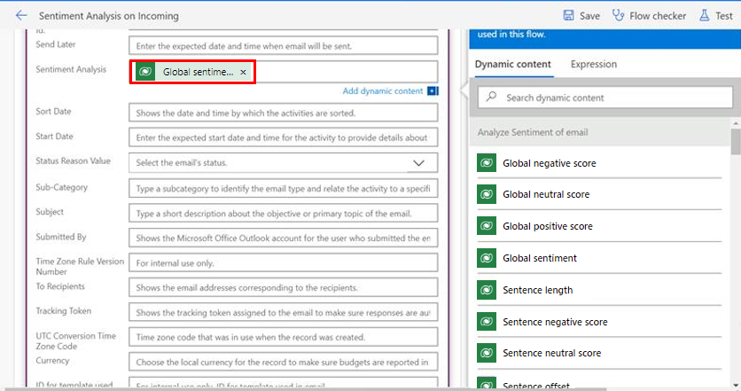

# Use the sentiment analysis prebuilt model in Power Automate

In this article, we will create a flow that uses the AI Builder sentiment analysis prebuilt model.

1. Sign in to [Power Automate](https://flow.microsoft.com/).

1. Select **My flows** in the left pane, and then select **New flow** > **Instant cloud flow**.

1. Name your flow, select **Manually trigger a flow** under **Choose how to trigger this flow**, and then select **Create**.

1. Expand **Manually trigger a flow**, and then select **+Add an input** > **Text**.

1. Replace **Input** with **My Text** (also known as the title).

1. Select **+ New step** > **AI Builder**, and then select **Analyze positive or negative sentiment** in the list of actions.

1. In the **Language** input, select or enter your language.

1. In the **Text** input, select **My Text** from the **Dynamic content** list:

    > [!div class="mx-imgBorder"]
    > 

1. In the successive actions, you can use any columns extracted by the AI Builder model. For example, you can add lines to an Excel file for each sentence using **Sentence sentiment**, **Probability sentence is positive** and **Probability sentence is negative**:

    > [!div class="mx-imgBorder"]
    > 

Congratulations! You've created a flow that uses the sentiment analysis model. Select **Save** on the top right, and then select **Test** to try out your flow.

## Parameters

### Input

|Name |Required |Type |Description |Values |
|---------|---------|---------|---------|---------|
|**Text** |Yes |string |Text to analyze |Text sentences |
|**Language** |Yes |string | Language of the text to analyze | Item in a list of predefined languages or a language code (ex.: "en", "fr", "zh_chs", "ru")

### Output

|Name |Type |Description |Values |
|---------|---------|---------|---------|
|**Overall text sentiment** |string |Overall sentiment of the analyzed text|Positive, neutral or negative |
|**Probability overall text is positive** |float |Probability of the positive sentiment in the analyzed text|Value in the range of 0 to 1. Values close to 1 indicate greater confidence that the identified sentiment is accurate |
|**Probability overall text is negative** |float |Probability of the negative sentiment in the analyzed text|Value in the range of 0 to 1. Values close to 1 indicate greater confidence that the identified sentiment is accurate |
|**Probability overall text is neutral** |float |Probability of the neutral sentiment in the analyzed text|Value in the range of 0 to 1. Values close to 1 indicate greater confidence that the identified sentiment is accurate |
|**documentScores** |object |Object containing overall scores|Positive, neutral and negative scores |
|**sentences** |List |List of sentence data structures containing sentences overall sentiment and scores |Sentence sentiment, positive, neutral and negative scores |
|**Sentence sentiment** |string |Sentiment of the analyzed sentence|Positive, neutral or negative |
|**Probability sentence is positive** |float |Probability of the positive sentiment in the analyzed sentence|Value in the range of 0 to 1. Values close to 1 indicate greater confidence that the identified sentiment is accurate |
|**Probability sentence is negative** |float |Probability of the negative sentiment in the analyzed sentence|Value in the range of 0 to 1. Values close to 1 indicate greater confidence that the identified sentiment is accurate |
|**Probability sentence is neutral** |float |Probability of the neutral sentiment in the analyzed sentence|Value in the range of 0 to 1. Values close to 1 indicate greater confidence that the identified sentiment is accurate |
|**sentenceScores** |object |Data structure containing sentence scores|Positive, neutral, and negative scores |

## Use sentiment analysis to analyze incoming Dynamics 365 emails

Power Automate provides a template that enables you to analyze incoming Dynamics 365 emails by using AI Builder sentiment analysis. This template requires some customization of your Microsoft Dataverse email table before you can use it.

1. Create an attribute in your Email Messages table in which to save the sentiment analysis results.

   For information about how to create an attribute, see [Create and edit column for Dataverse using Power Apps portal](/powerapps/maker/common-data-service/create-edit-field-portal).

1. Sign in to [Power Automate](https://flow.microsoft.com/signin).
1. In the left pane, select **Templates**, and then search for **ai builder sentiment**.
1. Select **Analyze sentiment of Dynamics emails using AI Builder**.
1. Select your environment, and then select **Continue**.
1. Type **Email Messages** in the **Entity Name** input.
1. Type **Organization** in the **Scope** input.

   > 

1. Next, the template shows messages from **draft emails** and **received emails**. You can filter these if you want to perform sentiment analysis only on selected email statuses. For a list of status codes, see [StatusCode choices](/powerapps/developer/data-platform/reference/entities/email#statuscode-choicesoptions).
1. Select **Add sentiment to CDS Email Entity**, select **Show advanced options**, and then locate the attribute you added in step 1.
1. Finally, add **Global sentiment** from the **Dynamic content** list.

   > 

If you want this column to be visible in your email grid view, follow these steps:

1. Go to the view/form designer, and add the custom column you created in step 1 of the preceding procedure. For information about how to add the column to your view, see [Add a column to your view](/dynamics365/customerengagement/on-premises/customize/create-edit-views-app-designer#add-a-column-to-your-view).

1. Add a field to the form. For details, see [Add a field to a form](/dynamics365/customerengagement/on-premises/customize/add-field-form).

### See also

[Sentiment analysis overview](prebuilt-sentiment-analysis.md)

[!INCLUDE[footer-include](includes/footer-banner.md)]
