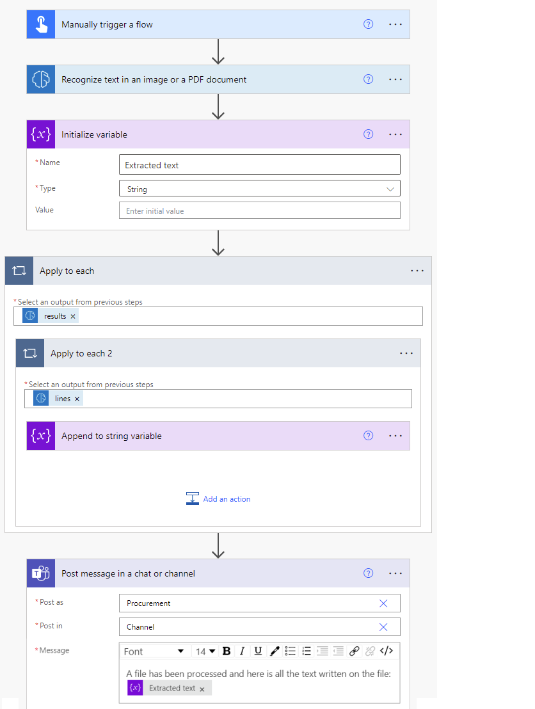

# Use the text recognition prebuilt model in Power Automate

1. Sign in to [Power Automate](https://flow.microsoft.com/), select the **My flows** tab, and then select **New > +Instant-from blank**.
1. Name your flow, select **Manually trigger a flow** under **Choose how to trigger this flow**, and then select **Create**.
1. Expand **Manually trigger a flow**, select **+Add an input**, select **File** as the input type, and set as input title **My Image**.
1.	Select **+ New step**, search for **AI Builder** in the Search for filters and actions box, and then select **Recognize text in an image** in the list of actions.
1.	Specify the **My Image** column from the trigger in the **Image** input for your flow:

    > [!div class="mx-imgBorder"]
    > 

1. To process results, select **+New step** and select **Apply to each**. In the column, select **lines** from the AI Builder model. This will automatically create another Apply to each action.
1. In the successive actions, you can use any fields extracted by the AI Builder model. For example, you can extract **Text** column to a SharePoint list:

    > [!div class="mx-imgBorder"]
    > 

Congratulations! You've created a flow that uses a text recognition model. You can continue to build on this flow until it suits your needs. Select **Save** on the top right, and then select **Test** to try out your flow. 

## Parameters
### Input
|Name |Required |Type |Description |
|---------|---------|---------|---------|
|**Image** |Yes |file |Image to analyze|

### Output

**Note:** The detected text is embedded into **lines** sub list of the **results** list. You first need to select the **lines** column from an **Apply to each** action to view all the following columns.

|Name |Type |Description |
|---------|---------|---------|
|**Text** |string |Strings containing the line of text detected |
|**Page number** |string |Page number of the text detected |
|**Coordinates** |float |Coordinates of the text detected |

### See also

[Text recognition overview](prebuilt-text-recognition.md)

[!INCLUDE[footer-include](includes/footer-banner.md)]