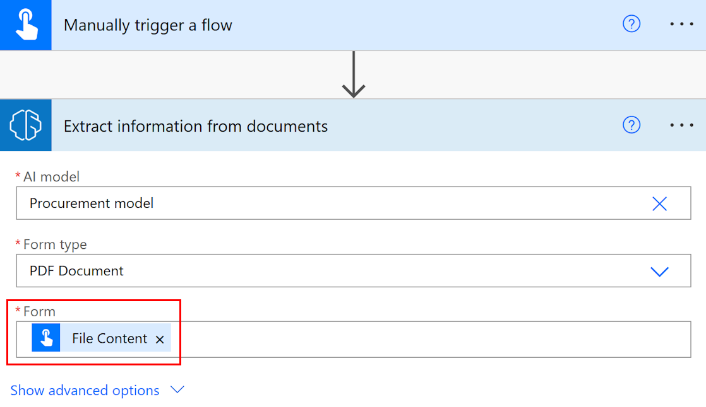
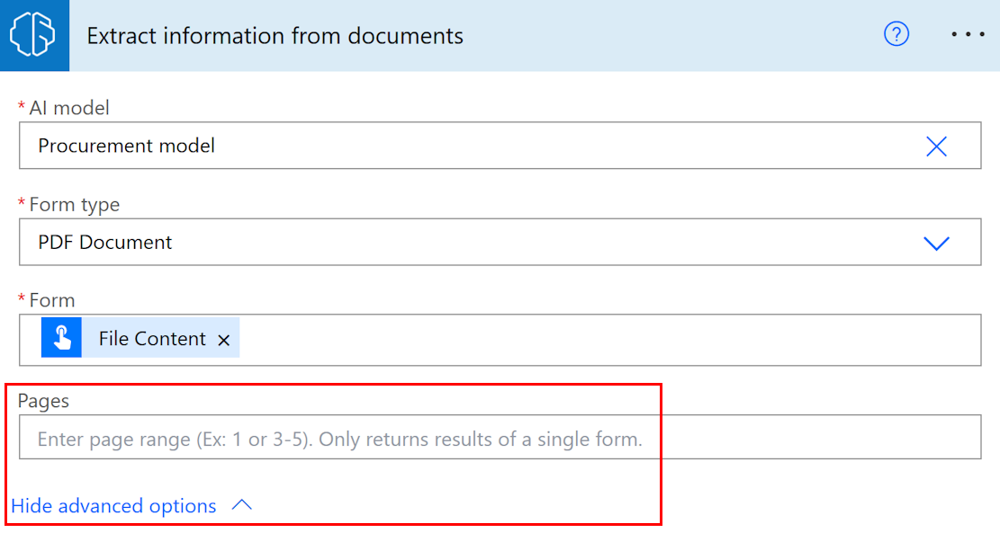
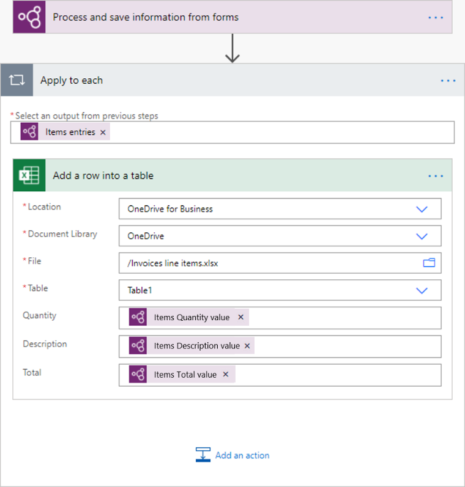
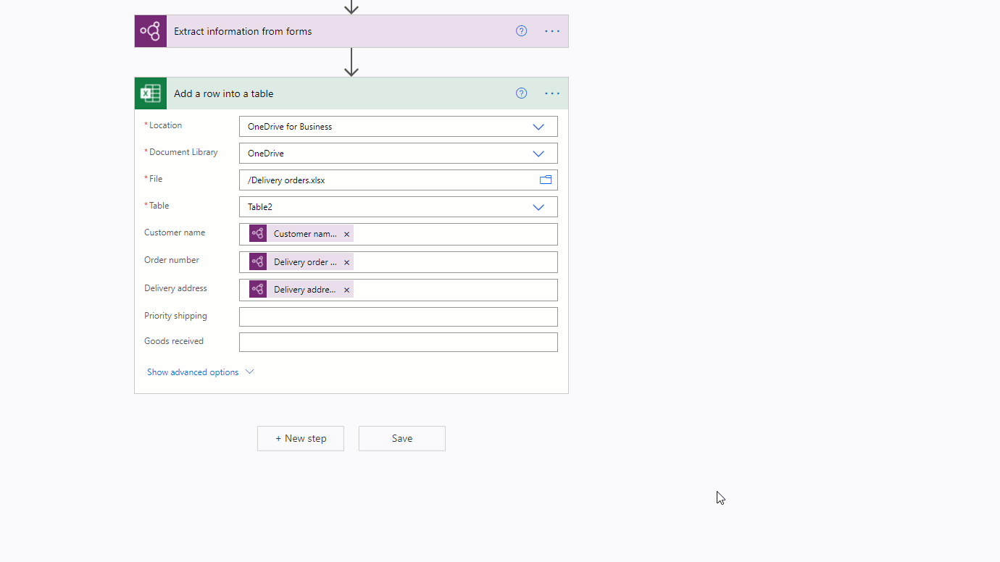
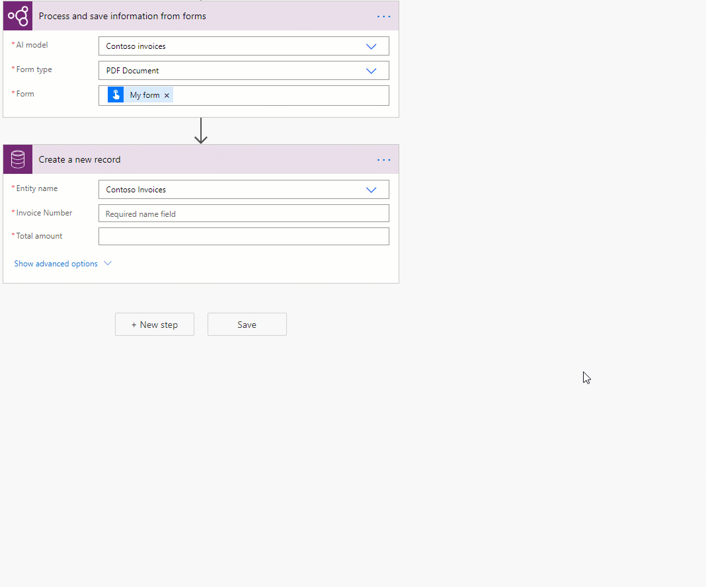
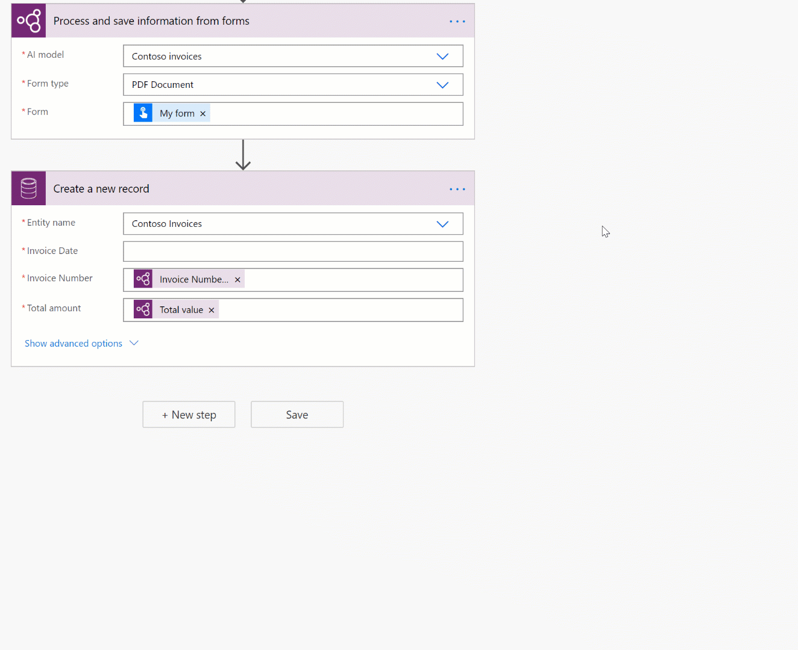
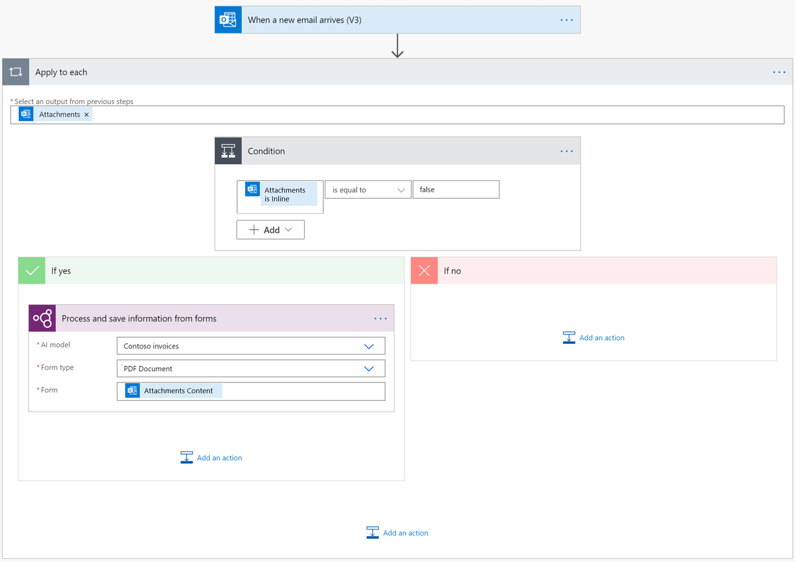

# Use a form processing model in Power Automate

1. Sign in to [Power Automate](https://flow.microsoft.com/).

1. Select **My flows** in the left pane, and then select **New flow** > **Instant cloud flow**.

1. Name your flow, select **Manually trigger a flow** under **Choose how to trigger this flow**, and then select **Create**.

1. Expand **Manually trigger a flow**, and then select **+Add an input** > **File** as the input type.

1. Select **+New step** > **AI Builder**, and then select **Extract information from forms** in the list of actions.

1. Select the form processing model you want to use, and then select the document type.

1. In the **Form** field, add **File Content** from the trigger:

    > [!div class="mx-imgBorder"]
    > 

1. In the successive actions, you can use any of the fields and tables extracted by the AI Builder model. For example, let's say that our model is trained to extract the *Lot number*, the *Net weight*, and the *Gross weight* values. We also want to post these to a Microsoft Teams channel after AI Builder has extracted them from the document. Just add the **Post a message** action from the Microsoft Teams connector, and then select your fields from the list of tokens.

    > [!NOTE]
    >
    >- To retrieve the value for a field, select **<field_name> value** . For example, for the *Lot number* field, select **Lot number value**.
    >- To retrieve the value for a checkbox, select **<checkbox_name> value**. For example, for a checkbox named *Priority shipping*, select **Priority shipping value**. The return value is of type Boolean: `true` if the checkbox is marked as selected in the document, `false` if it’s not.
    >- To retrieve the confidence score for an extracted item, select **<field_name> confidence score**. For example, for the *Lot number* field, select **Lot number confidence score**.

    > [!div class="mx-imgBorder"]
    > 

Congratulations! You've created a flow that uses an AI Builder form processing model. Select **Save** on the top right, and then select **Test** to try out your flow.

## Page range

For documents that have multiple pages, it's possible to specify the page range to process.

   > [!div class="mx-imgBorder"]
   > 

You can enter a page value or page range in the **Pages** parameter. Example: 1 or 3-5.

>[!NOTE]
> If you have a large document with only one form, we strongly recommend to **use the Pages parameter to aim at your form and therefore reduce the cost of model prediction and increase performance**. However, the page range should contain a **unique form** for the action to return correct data.
> 
> Example: A document contains a first form in page 2 and a second form that spans over pages 3 and 4:
> - If you enter page range 2, it will return the data of the first form.
> - If you enter page range 3-4, it will only return the data of the second form.
> - If you enter page range 2-4, it will return partial data of first and second form (should be avoided).

## Parameters
### Input
|Name |Required |Type |Description |Values |
|---------|---------|---------|---------|---------|
|**AI Model** |Yes |model |Form processing model to use for analysis|Trained and published form processing models |
|**Document type** |Yes |list |The file type of the form to analyze|PDF Document (.pdf), JPEG Image (.jpeg), PNG Image (.png) |
|**Form** |Yes |file |Form to process| |
|**Pages** |No |string |Page range to process| |

### Output
|Name |Type |Description |Values |
|---------|---------|---------|---------|
|**{field} value** |string |The value extracted by the AI model| |
|**{field} confidence score** |float |How confident the model is in its prediction |Value in the range of 0 to 1. Values close to 1 indicate greater confidence that the extracted value is accurate |
|**{table}{column} value** |string |The value extracted by the AI model for a cell in a table| |
|**{table}{column} confidence score** |float |How confident the model is in its prediction |Value in the range of 0 to 1. Values close to 1 indicate greater confidence that the extracted cell value is accurate |

> [!NOTE]
> More output parameters may be proposed such as field coordinates, polygons, bounding boxes and page numbers. These are not listed on purpose as mainly intended for advanced use.

## Common use cases

### Iterate a form processing table output in Power Automate

To illustrate this procedure, we use the following example where we have trained a form processing model to extract a table that we have named **Items** with three columns: **Quantity**, **Description** and **Total**. We wish to store each line item from the table into an Excel file.

> [!div class="mx-imgBorder"]
> 

1. Select the field you wish to write the cell for a table. The dynamic content panel will open showing everything that the form processing model knows how to extract. Search for **{your table name} {your column name} value**. Our example uses *Items Quantity value*.

> [!div class="mx-imgBorder"]
> 

2. Once you add this value, the action where you added it is automatically inserted into an **Apply to each** control. This way, every row in the table will be processed when the flow is run.

3. Keep adding columns you want to iterate.

> [!div class="mx-imgBorder"]
> 

> [!NOTE]
> Tables extracted by form processing currently don't return a confidence score.

### Process outputs of checkboxes in Power Automate

Checkboxe values are of type Boolean: `true` means the checkbox is marked as selected in the document, and `false` means it’s not.

One way you can check its value is with a **Condition** action. If the checkbox value is equal to `true`, then execute one action. If the value is `false`, execute a different action. The following illustration shows an example.

> [!div class="mx-imgBorder"]
> 

Another option is to map the `true`/`false` output of the checkbox to other values of your choice by using the [if](/azure/logic-apps/workflow-definition-language-functions-reference#if) expression. For example, you might have a column in an Excel file where you want to write ‘Priority’ if one of the checkboxes in the document is selected, or ‘Non-priority’ if not selected. To do this, you can use the following expression: `if(<form processing output>, 'Priority', 'Non-priority')`. The following animation shows an example.

> [!div class="mx-imgBorder"]
> 

### Remove currency symbols (€, $,…) in a form processing output in Power Automate

To illustrate, the *Total* value extracted by the form processing model might have a currency symbol, for example, \$54. To remove the $ sign, or any other symbols you want to omit, use the [replace](/azure/logic-apps/workflow-definition-language-functions-reference#replace) expression to remove it. Here's how:

`replace(<form processing output>, '$', '')`

> [!div class="mx-imgBorder"]
> 

### Convert a form processing output string to a number in Power Automate

AI Builder form processing returns all extracted values as strings. If the destination where you want to save a value extracted by AI Builder form processing requires a number, you can convert a value to number using the [int](/azure/logic-apps/workflow-definition-language-functions-reference#int) or [float](/azure/logic-apps/workflow-definition-language-functions-reference#float) expression. Use int if the number has no decimals. Use float if the number does have decimals. Here's how to do it:

`float('<form processing output>')`

> [!div class="mx-imgBorder"]
> 

### Remove blank spaces in a form processing output in Power Automate

To remove blank spaces from output values, use the [replace](/azure/logic-apps/workflow-definition-language-functions-reference#replace) function:

`replace(<form processing output>, ' ', '')`

> [!div class="mx-imgBorder"]
> 

### Convert a form processing output string to a date in Power Automate

AI Builder form processing returns all outputs as strings. If the destination where you want to save a value extracted by form processing is required to be in date format, you can convert a value that contains a date into date format. Do this by using the [formatDateTime](/azure/logic-apps/workflow-definition-language-functions-reference#formatDateTime) expression. Here's how to do it:

`formatDateTime(<form processing output>)`

> [!div class="mx-imgBorder"]
> 

### Filter email signature from a flow so that is not processed by the form processing model (Office 365 Outlook)

For incoming emails from the Office 365 Outlook connector, email signatures are picked up by Power Automate as attachments. To keep these from being processed by the form processing model, add a condition to your flow that checks if the output from the Office 365 Outlook connector named **Attachments is Inline** is equal to false. In the **If yes** branch of the condition, add the form processing action. With this, only email attachments that are not inline signatures will be processed.

> [!div class="mx-imgBorder"]
> 

### See also

[Overview of the form processing model](form-processing-model-overview.md)

[!INCLUDE[footer-include](includes/footer-banner.md)]
