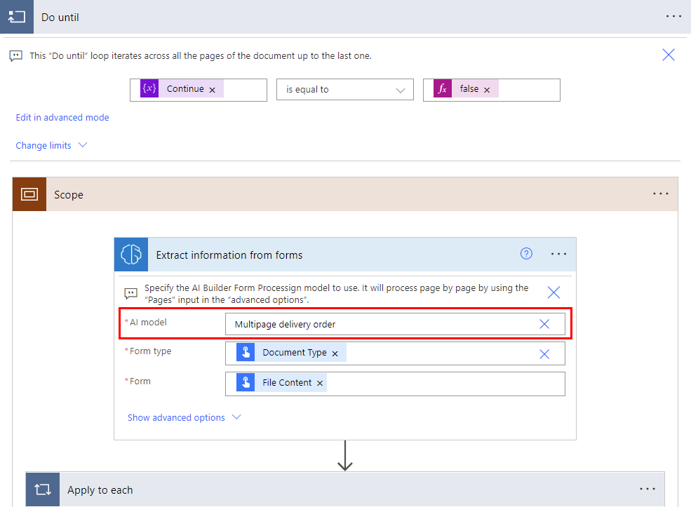
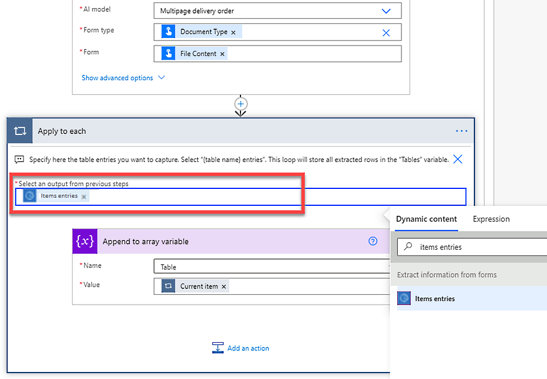

# Process multipage tables in form processor (experimental)

[This topic is pre-release documentation and is subject to change.]

> [!IMPORTANT]
> - This is an experimental feature. Experimental features aren’t meant for production use and might have restricted functionality. These features are available before moving up to the preview stage so that early adopter customers can try out something useful or help test the feature.
> 
> - For more information about experimental feature and how to enable it, see [Understand experimental, preview, and retired features in Power Apps](https://review.docs.microsoft.com/en-us/powerapps/maker/canvas-apps/working-with-experimental-preview?branch=master).

Depending on how many pages your table can span, there are many options you can leverage. If the table you want to extract:

- [Is from an invoice](#extract-a-table-from-an-invoice)
- [Spans up to two pages](#extract-a-table-that-spans-up-to-two-pages)
- [Spans more than two pages](#extract-a-table-that-spans-more-than-two-pages)

You can also [specify specific fields for your table pages](#extract-fields-for-specific-pages), such as headers.

## Extract a table from an invoice

If the invoice you are looking to process is an English invoice from the United States, the invoice processing prebuilt model can extract line items, and then span multiple pages without to need to train a model.

For instructions, go to [Invoice processing prebuilt model](prebuilt-invoice-processing.md).

## Extract a table that spans up to two pages

With the multipage table experimental feature, you can train a form processing model to extract data from tables then span up to two pages.

1. [Create a new form processing model](create-form-processing-model.md).

1. The first step is to [define fields and tables to extract](create-form-processing-model.md#define-fields-and-tables-to-extract). On the **Choose information to extract** screen, select **Add** > **Multipage table (experimental)** to enable the experimental feature.

    Rows that cut across pages aren't supported.

1. Follow all steps in [Create a new form processing model](create-form-processing-model.md) before you train your model.

    When uploading sample documents to train, upload as many documents as possible with tables that span up to two pages.

## Extract a table that spans more than two pages

For tables that span more than two pages, we recommend that you do the following:

1. [Tag the table](create-form-processing-model.md#tag-tables) on the first page where it's present.

1. After the model has been trained, process the document page-by-page by leveraging the [page range](form-processing-model-in-flow.md#page-range) feature.

    Rows that cut across pages aren't supported.

1. Capture all the tables across all pages and merge them in a single table.

The following steps will guide you on how to do this:

1.	[Create a new form processing model](create-form-processing-model.md).

2.	The first step is to [define fields and tables to extract](create-form-processing-model.md#define-fields-and-tables-to-extract).

    Depending on how your table is placed on the document, do one of the following on the **Choose information to extract** screen:

    - If the first occurrence of the table has different surrounding elements than the tables in the following pages, select **Add** > **Multipage table (experimental)** to enable the experimental feature.

        > [!div class="mx-imgBorder"]
        > 

    - If the tables look the same and have similar looking surrounding elements in all pages, select **Add** > **Single page table**.

        > [!div class="mx-imgBorder"]
        > 

    This sample template iterates through all the pages in the document. If you know the page range where to iterate, you can update the logic on the **Do until** loop. 

1.	Follow all the steps to [train the form processing model](form-processing-train.md). 
    - If you selected **Multipage table (experimental)**, tag the first two pages of the document where the table is present. 
    
    - If you selected **Single page table**, tag only the first page where the table is present.

1.	After your form processing model is [trained and published](form-processing-train.md), you can use it in a cloud flow in Power Automate and process documents one page at a time to extract the tables for all pages.

Here's an example that iterates across all pages on the document.

1. Select [cloud flow template](https://preview.flow.microsoft.com/en-us/galleries/public/templates/59284c1735b745dda07032720f31de47/use-form-processing-to-extract-tables-than-span-across-multiple-pages/) > **Continue**.

1. Specify the form processing model you've trained on the **Extract information from forms** action.

    > [!div class="mx-imgBorder"]
    > 

1. On the first **Apply to each** action, add the input entries from your table.
    - You should select *{table name}* entries.
    - Replace *{table name}* with the name of the table in your model.

    > [!div class="mx-imgBorder"]
    > 

1. The last **Apply to each 2** action iterates through the table that contains all the rows that have been extracted across all pages. Here you can add any action where you want to save the extracted data. To reference the columns you want to extract, you must use the following expression:

    items('Apply_to_each_2')?['*{column name}*']?['value']

    Replace *{column name}* with the name of the column in your table.

    > [!div class="mx-imgBorder"]
    > 

You can now save and test this flow to see it in action. You can then customize it to meet your needs.

For information on testing, go to [Quick-test your model](form-processing-train.md).

## Extract fields for specific pages

You can extract fields for specific pages. For example, you might want header fields from the first page.

To extract fields for specific pages:

1. Add a **Do until** loop after the **Extract information from forms** action.

1. Select the **Current Iteration Index** condition.

1. Select **is equal to** from the dropdown.

1. Enter the *{page number}* - 1.

For example, the condition for the first page would be **Current Iteration Index is equal to 0**.

 > [!div class="mx-imgBorder"]
 > 

### See also

[Use a form processing model in Power Automate](form-processing-model-in-flow.md)
