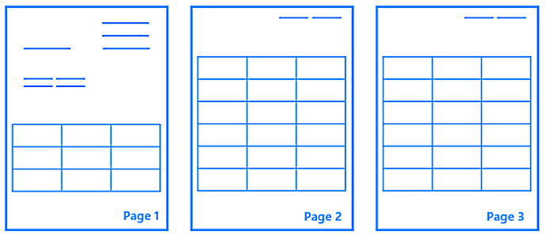
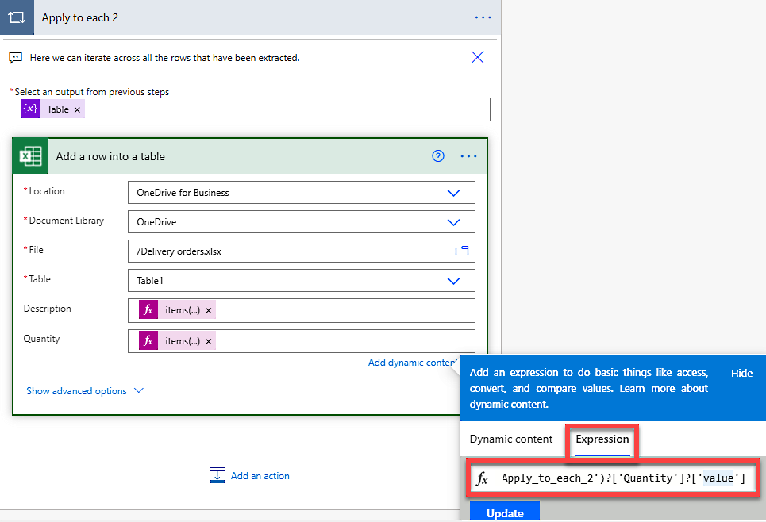

# Process multipage tables in document processing (experimental)

[This topic is pre-release documentation and is subject to change.]

> [!IMPORTANT]
> - This is an experimental feature. Experimental features aren't meant for production use and might have restricted functionality. These features are available before moving up to the preview stage so that early adopter customers can try out something useful or help test the feature.
>
> - This experimental feature is not supported by Microsoft Support.
> 
> - For more information about experimental features and how to enable them, go to [Understand experimental, preview, and retired features in Power Apps](/powerapps/maker/canvas-apps/working-with-experimental-preview).

Depending on how many pages your table can span, you can choose from the following options to extract a table that:

- [Is from an invoice](#extract-a-table-from-an-invoice).
- [Spans up to two pages](#extract-a-table-that-spans-up-to-two-pages).
- [Spans more than two pages](#extract-a-table-that-spans-more-than-two-pages).

## Extract a table from an invoice

If the invoice you're looking to process is an English-language invoice from the United States, the invoice processing prebuilt model can extract line items, and then span multiple pages without the need to train a model.

For instructions, go to [Invoice processing prebuilt model](prebuilt-invoice-processing.md).

## Extract a table that spans up to two pages

1. [Create a new document processing model](create-form-processing-model.md).

1. Perform the steps in [Define fields and tables to extract](create-form-processing-model.md#define-information-to-extract). On the **Choose information to extract** screen, select **Add** > **Multipage table (experimental)** to enable the experimental feature.

1. Follow the rest of the steps in [Create a new document processing model](create-form-processing-model.md) before you train your model.

    When uploading sample documents to train, upload as many documents as possible with tables that span up to two pages.

## Extract a table that spans more than two pages

For tables that go beyond two pages, [tag the table](create-form-processing-model.md#tag-documents) on the first pages where it's present. Once the model has been trained, process the document page-by-page using the [page range](form-processing-model-in-flow.md#page-range) feature to capture all the tables across all pages, and merge them in a single table.

The following steps will guide you on how to achieve this:

1. [Create a new document processing model](create-form-processing-model.md).

1. Perform the steps in [Define fields and tables to extract](create-form-processing-model.md#define-information-to-extract).

    On the **Choose information to extract** screen, do one of the following:

    - If the first occurrence of the table has different surrounding elements than the tables on the following pages, select **Add** > **Multipage table (experimental)** to enable the experimental feature.

        > [!div class="mx-imgBorder"]
        > 

    - If the tables look the same and have similar-looking surrounding elements on all pages, select **Add** > **Single page table**.

        > [!div class="mx-imgBorder"]
        > 

1. Follow all the steps to train the document processing model.

    - If you selected **Multipage table (experimental)**, tag the first two pages of the document where the table is present. 

    - If you selected **Single page table**, tag only the first page where the table is present.

1. After your document processing model is trained and published, you can use it in a cloud flow in Power Automate, and process documents one page at a time to extract the tables for all pages.
 
If you get an error message during extraction, go to [AI Builder document processing isn't extracting tables that span across multiple pages](/troubleshoot/power-platform/ai-builder/aibuilder-form-processing-is-not-extracting-tables-that-span-across-multiple-pages) for a possible resolution.

### Use a cloud flow to process all pages in the document

The sample template in this procedure iterates through all the pages in the document. If you know the page range where you'd like to iterate, you can update the logic on the **Do until** loop.

1. Select [this cloud flow template](https://flow.microsoft.com/en-us/galleries/public/templates/59284c1735b745dda07032720f31de47) > **Continue**.

1. On the **Extract information from forms** action in the **AI model** field, specify the document processing model you've trained.

    > [!div class="mx-imgBorder"]
    > 

1. On the first **Apply to each** action, add the input entries from your table. Select *{table name}* entries, replacing *{table name}* with the name of the table in your model.

    > [!div class="mx-imgBorder"]
    > 

1. The last **Apply to each 2** action iterates through the table that contains all the rows that have been extracted across all pages. Here you can add any action where you want to save the extracted data. To reference the columns you want to extract, use the following expression and replace *{column name}* with the name of the column in your table:

    `items('Apply_to_each_2')?['*{column name}*']?['value']`

    > [!div class="mx-imgBorder"]
    > 

You can now save and test this flow to see it in action. You can then customize it to meet your needs.

### Extract fields for specific pages

You can extract fields for specific pages. For example, you might want header fields from the first page.

1. Add a **Do until** loop after the **Extract information from forms** action.

1. Select the **Current Iteration Index** condition.

1. Select **is equal to** from the dropdown list.

1. Enter the *{page number}* &minus; 1.

   For example, the condition for the first page would be **Current Iteration Index is equal to 0**.

> [!div class="mx-imgBorder"]
> 

## Limitation

Rows that cut across pages (for example, row 30 starts at the bottom of page 1 and ends at the top of page 2), aren't supported.

### See also

[Use a document processing model in Power Automate](form-processing-model-in-flow.md)
