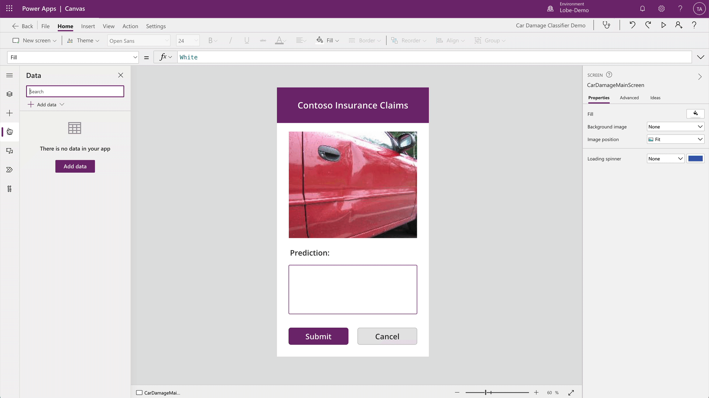

# Use an image classification model by Lobe in Power Apps (preview)

[!INCLUDE[cc-beta-prerelease-disclaimer](./includes/cc-beta-prerelease-disclaimer.md)]

To use your image classification model with Power Fx, first you need to register it as a data source in your app. To learn how to do this, go to [Integrate the registered model](https://github.com/microsoft/PowerApps-Samples/tree/master/ai-builder/BringYourOwnModelTutorial#step-32-integrate-the-registered-model).

*(Markus: Is third bullet point needed?)*
> [!IMPORTANT]
> - This is a preview feature.
>
> - [!INCLUDE[cc_preview_features_definition](includes/cc-preview-features-definition.md)]
>
> - This feature is being gradually rolled out across regions and might not be available yet in your region.

## Use your classification model in a canvas app

1. Sign in to [Power Apps](https://make.powerapps.com).

1. Select **Create** > **Canvas app from blank**.

    > [!div class="mx-imgBorder"]
    > 

1. In the **App name** field, enter a name and select **Create**.

1. If you see the **Welcome to Power Apps Studio** screen, select **Skip**.

1. Select **Data** > **Add data** > **AI Models**.

1. On the dropdown, select the image classification model you want to add.

    > [!div class="mx-imgBorder"]
    > 

## Add images and descriptions

1. Add an image by selecting an area on the canvas.

1. In the box below **Prediction**, type a description.

1. Select **Submit**.

    > [!div class="mx-imgBorder"]
    > 

## Add a Power Fx formula

1. Select the control area next to **Prediction**.

1. On the formula bar, type **'Model Name'.Predict(Image).Prediction**.

    In the following example, you would type this:

    ````powerapps-dot
    'Car Damage Classifier'.Predict(AddMediaButton.Media).Prediction
    ````
    > [!div class="mx-imgBorder"]
    > 
    
    The last property in the formula, `.Prediction`, will return the predicted label for the image from the model. If you want a list of all the possible labels and their corresponding confidence values from the model, use the `.Labels` property in the following example:

    ````powerapps-dot
    'Model Name'.Predict(Image).Labels
    ````
