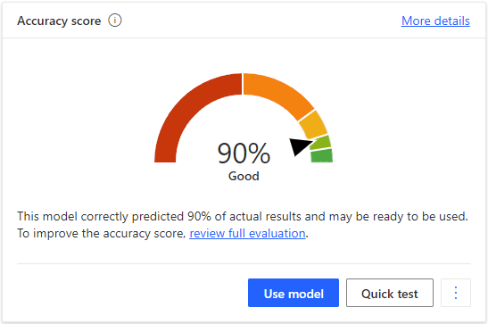
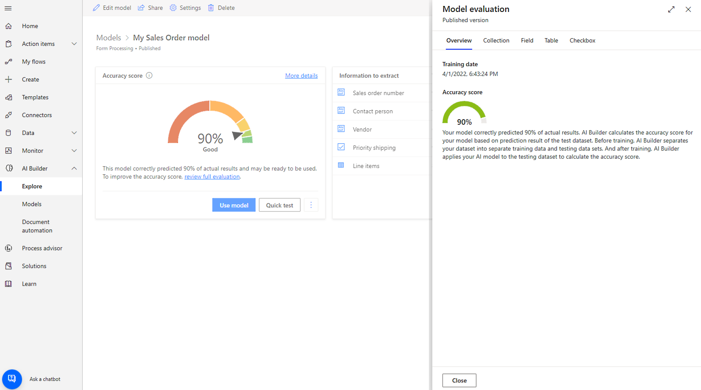
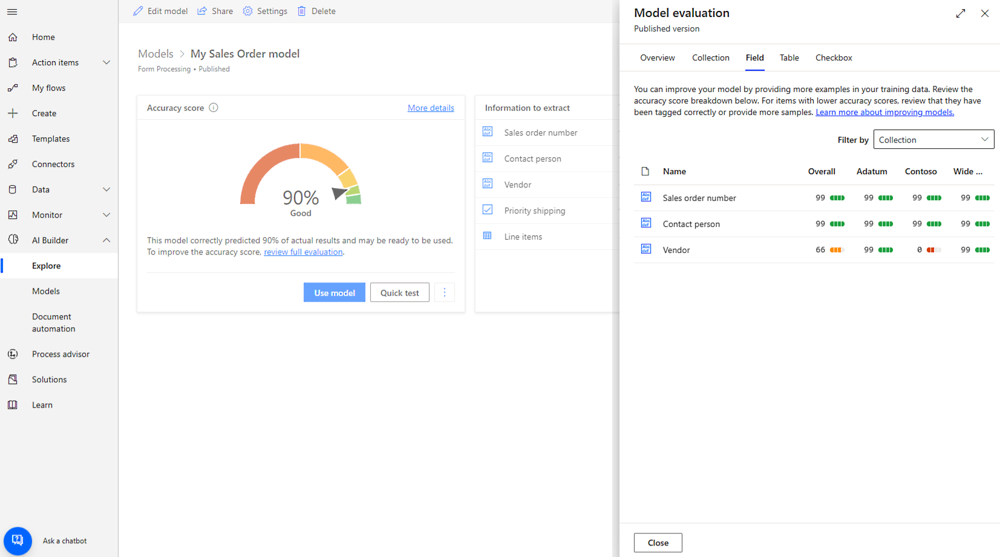
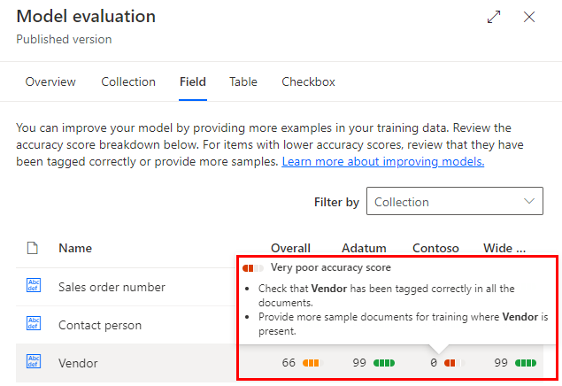

# Improve the performance of your form processing model

If your model performance isn't where you want it to be, for example you're getting bad results or low confidence scores, there are some things you can try.

## Interpret your model accuracy score

Interpret your accuracy score to identify what your model is struggling to extract. Model evaluations include recommendations for raising the score.

To learn how an accuracy score is calculated, go to [Accuracy score](prediction-performance.md#accuracy-score).

1. Sign in to [Power Apps](https://make.powerapps.com/) or [Power Automate](https://flow.microsoft.com/signin).

1. In the left pane, select **AI Builder** > **Models**.

1. Open the model you want to investigate. You should see the accuracy score.

    If you don't see the accuracy score, your model might not have been trained since January 1, 2022 or it includes functionality that's in preview. We recommend that you retrain your model and go back to the page once done.

1. On the model details page, you should see the general accuracy score. <!--Is this the same score as in step 2-->

    > [!div class="mx-imgBorder"]
    > 

1. To get details, select **review full evaluation**.

    > [!div class="mx-imgBorder"]
    > 

    In this panel, you can navigate among different tabs to identify what your model is struggling to extract. You can browse the **Collection**, **Field**, **Table**, and **Checkbox** tabs to find what isn’t processed properly.

    Here's an example of the information in the **Field** tab.

    > [!div class="mx-imgBorder"]
    > 

    In this example, you'll want to improve the accuracy of the **Vendor** information.

    > [!div class="mx-imgBorder"]
    > 

    You can improve the accuracy score by adding more documents to the training data. You can learn how to do this in the next section in this article.

### Common questions

**What can I do if I have a low accuracy score for a field, table, or checkbox?**

1. Check that the field, table, or checkbox has been tagged correctly in all the documents.

1. Provide more sample documents for training where the field, table, or checkbox is present. 

**What can I do if I have a low accuracy score for a collection?**

Check that the documents within the collection all have the same layout. To learn more about collections, go to [Group documents by collections](create-form-processing-model.md#group-documents-by-collections). 

## Add more documents to the training data

The more documents you tag, the more AI Builder will learn how to better recognize the fields. To add more documents, edit your form processing model and upload more documents. You'll find the option to edit the model on the details page of the model.

> [!div class="mx-imgBorder"]
> 

## More tips

- For filled-in forms, use examples that have all of their fields filled in.
- Use forms with different values in each field.
- If your form images are of lower quality, use a larger data set (10-15 images, for example).
- If possible, use text-based PDF documents instead of image-based documents. Scanned PDFs are handled as images.
- When you create a form processing model, upload documents with the same layout where each document is a separate instance. For example, invoices from different months should be in separate documents and not all in the same one.
- Documents that have different layouts should go [into different collections](create-form-processing-model.md#group-documents-by-collections) when you upload samples for training. 
- If the form processing model is extracting values from neighboring fields from the one you want the model to extract, edit the model and tag adjacent values that are being picked up incorrectly as being different fields. By doing this, the model will better learn the boundaries for each field.

### See also

- [Invoice processing prebuilt model](prebuilt-invoice-processing.md)
- [Receipt processing prebuilt model](prebuilt-receipt-processing.md)

[!INCLUDE[footer-include](includes/footer-banner.md)]
