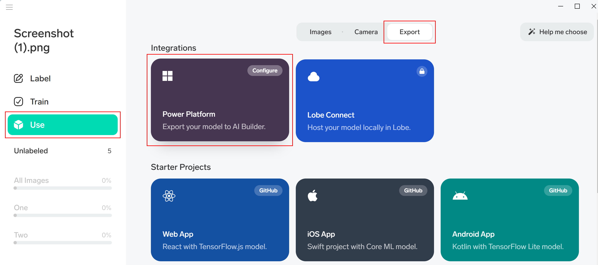

# Export your image classification model from Lobe to AI Builder (preview)

[!INCLUDE[cc-beta-prerelease-disclaimer](./includes/cc-beta-prerelease-disclaimer.md)]

Lobe is integrated with Microsoft Power Platform, which adds the ability to export your model to AI Builder for use in Power Apps and Power Automate.

> [!IMPORTANT]
> - This is a preview feature.
> - [!INCLUDE[cc_preview_features_definition](includes/cc-preview-features-definition.md)]
> - This feature is being gradually rolled out across regions and might not be available yet in your region.

## Export a model to Power Platform

1. In Lobe, select **Use** > **Export** > **Power Platform**.

    > [!div class="mx-imgBorder"]
    > 

1. Sign in with the credentials you use to sign in to the Power Platform environment.

1. Name your model, and then choose the environment where you'll use your model.

1. Select **Export**.

> [!NOTE]
> If you have access to multiple environments, make sure you're in the correct environment for your model to be exported.

### For Application Lifecycle Management (ALM) users

For [ALM](/power-platform/alm/overview-alm) users, you can [create a solution from the model in AI Builder](byom-alm.md) to transfer it between environments. As an alternative, you can re-export the model to your environment of choice after validation in your app or flow.

## View your Lobe models in AI Builder

After you've exported your image classification model from Lobe, it appears in your list of models in AI Builder. Models that were exported from Lobe are listed in the **Model** column as **Image Classification**.

1. Sign in to Sign in to [Power Apps](https://make.powerapps.com) or [Power Automate](https://flow.microsoft.com/).

1. To view a list of models, select **AI Builder** > **Models** on the left pane.

1. To see details, select the model. This is where you can see project details, a summary of images with their test results, and a breakdown of labels. This information can help you decide to test your app or publish it.

## Next step

After you exported an image classification model to your Power Platform environment, you can use it in Power Apps or Power Automate.

- [Use an image classification model by Lobe in Power Apps](image-classification-component-in-powerapps.md)
- [Use an image classification model by Lobe in Power Automate](image-classification-model-in-flow.md)
