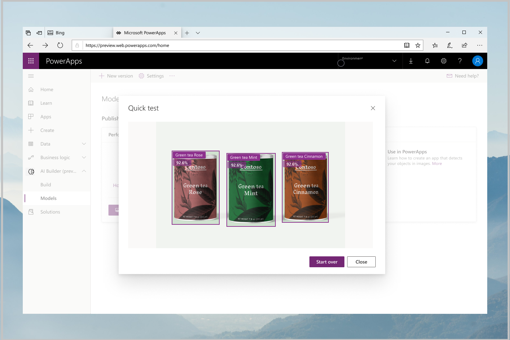

# Train and publish your object detection model

In this section, you'll learn how to verify your data and then how to train, test, and publish your model.

1. On the **Train your model** screen, verify that you have the correct names and the correct number of images.
2. If the data is all good, select **Train** to kick off the training of your object detection model.

## Quick-test your model

After your model is trained, you can see it in action from its details page. More information: [Manage your model in AI Builder](manage-model.md)

1. From your model details page, select **Quick Test** in the **Last trained version** section.
2. Upload<!--Edit okay, since it covers both methods? Writing Style Guide doesn't want us to use "drag and drop." --> an image that contains your objects to test your model.
3. Your model will be applied to the image you uploaded. This step might take a while.
4. After your model has finished running, the rectangles found will be drawn directly on the picture.

    > [!div class="mx-imgBorder"]
    > 

## How to interpret your model performance score

If you quick-test your model after it's trained, a performance score appears on its details page. This performance score indicates how well the model did on the images you uploaded. This score isn't an indication of how well it will perform on your future images because it hasn't seen them yet.

If you upload fewer than 50 images for a label, you're more likely get a high score—as high as 100&nbsp;percent. This doesn't mean your model is bulletproof. It means your model has made no mistake on a subset of the images you provided (called the _test set_). The smaller the training set, the smaller the test set, and the more likely it is that your model will be right when the performance score is calculated.

Model performance scores are more reliable when you have more than 50 images per label, and when these scores remain stable even when you change the training set.

## Publish your object detection model

From here, you can run more tests with other pictures. If you're happy with the results, you can [publish](publish-model.md) your model to use it in Power Apps or Power Automate.

## Limits

|**Action**|**Limit**|**Renewal period**|
|:-----|:-----|-----:|
|Object detection calls (per environment)|4800|60 seconds|

### See also

[Manage your model in AI Builder](manage-model.md)

[!INCLUDE[footer-include](includes/footer-banner.md)]