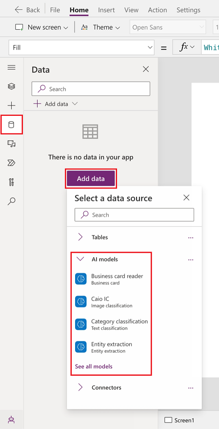
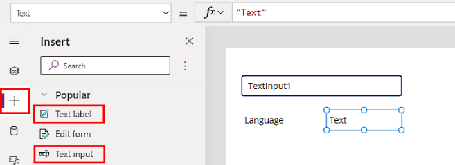

# Use Power Fx in AI Builder models in Power Apps (preview)

[!INCLUDE[cc-beta-prerelease-disclaimer](./includes/cc-beta-prerelease-disclaimer.md)]

Power Fx AI integration is a new approach that lets you reference AI models in any Power Apps control using the Power Fx open-source low code formula language. For example, you can detect the language of any user-contributed text and translate it to another language. If you've used canvas apps, you're already familiar with Power Fx.

> [!IMPORTANT]
>
> - This is a preview feature.
> - [!INCLUDE[cc_preview_features_definition](includes/cc-preview-features-definition.md)]
> - This feature is being gradually rolled out across regions and might not be available yet in your region.

## Requirements

To use Power Fx in AI Builder models, you must have:

- Access to a [Dataverse environment with a database](/power-platform/admin/create-environment#create-an-environment-with-a-database).

- AI Builder license (trial or paid).

- (For non-preview models) Starter or purchased AI credits.

## Enable the Power Fx feature

The Power Fx feature is enabled by default in Microsoft Power Apps. If it's been disabled and you want to enable it again, you can do this in canvas apps.

1. Sign in to [Power Apps](https://make.powerapps.com).

1. Create a canvas app by selecting **Create** > **Canvas app from blank**.

    > [!div class="mx-imgBorder"]
    > 

1. In the **App name** field, enter a name and select **Create**.

1. If you see the **Welcome to Power Apps Studio** screen, select **Skip**.

1. On the toolbar at the top, select **Settings**.

    > [!div class="mx-imgBorder"]
    > 

1. Select **Upcoming features** > **Preview**.

1. Enable the **All data models as sources** feature by scrolling to the end  and selecting **On**.

    > [!div class="mx-imgBorder"]
    > 

## Select a model in canvas apps

 To consume an AI model with Power Fx, you’ll need to create a canvas app, choose a control, and assign expressions to control properties.

For a list of AI Builder models you can consume, go to [AI models and business scenarios](model-types.md). You can also consume models built in Microsoft Azure Machine Learning with the [bring your own model](byo-model.md) feature.

1. Create an app by following steps 1 through 4 in [Enable the Power Fx feature](#enable-the-power-fx-feature).

1. Select **Data tab** > **Add data** > **AI Models**.

    > [!div class="mx-imgBorder"]
    > 

1. Select one or more models to add.

    If you don’t see your model in this list, you might not have permissions to use it in Power Apps. Contact your administrator to resolve this.

## Use a model in controls

The canvas app in this language detection model example shows you the country code for the language of the text you type.

1. Create a canvas app by following steps 1 and 2 in the previous section, [Select a model in canvas apps](#select-a-model-in-canvas-apps).

1. In the **AI models list**, select a language detection model.

1. Place a text input and two text labels on the canvas:
    1. Select **+** > **Text input** and place it on the canvas.
    1. Rename the text input to **TextInput1**.
    1. Select **Text label** and place it on the canvas.
    1. Rename the text label to **Language**.
    1. Add another text label by selecting **Text label** and place it to the right of the **Language** text label.
     
    > [!div class="mx-imgBorder"]
    > 

1. Select the text label you added in step 3e and enter the following Power Fx formula:

    ````powerapps-dot
    First('Language detection'.Predict(TextInput1.Text).results).language 
    ````
    Notice that the label changes to **(Unknown)**.

    > [!div class="mx-imgBorder"]
    > 

1. Try out your app by selecting the **Preview the app** icon in the upper-right corner.

    > [!div class="mx-imgBorder"]
    > 

1. In the textbox, type **bonjour**. Notice that the country code for France (**fr**) appears below the textbox.

    > [!div class="mx-imgBorder"]
    > 

1. Try out your app again by typing **guten tag**. Notice the country code for Germany (**de**) appears below the textbox.

> [!NOTE]
> If you move your app to a different environment, the model must be manually re-added to the app in the new environment.

## Input/output by model type

This section provides inputs and outputs for custom and prebuilt models by model type. 

### Custom models

|Model type  |Input  | Output
|---------|---------|---------|
|Category classification | Language code, text. | `results` Results is a table where each element has a type and a score. |
|Entity Extraction |Language code, text. | `entities` Entities is a table where each element has a type, score, startIdx, length, and value (string represented from startIdx to startIdx+length). |
|Form processing |Document type (mime type string), Document (base64 encoded string). | 4 properties. `layoutName` (string), `layoutConfidenceScore` (number), `labels` (record containing the fields that can be identified in the form), and `tables` (record containing tables identified in the form). |
|Object detection |Image encoded as base64. | `results` Results is a table with the different objects found in the picture. Each has a `boundingBox`, `confidence` value, and `tagId`. |
|Prediction | Properties defined when creating the model. Canvas receives these properties as a record. | A record with `Explanation`, `Likelihood`, and `Prediction` as properties. |

### Prebuilt models

|Model type  |Input  | Output
|---------|---------|---------|
| Business card reader | Image type (mime type), image encoded as base64. | `contact` Contact contains all possible fields that can be identified by the model, and `contactFields` (table that contains all identified fields in the input image, with `value`, `boundingBox`, `name`, and `parentName`). |
| Identity document reader | Image encoded as base64. | `result` Result is a record that contains a fields property, which holds all possible fields from the model. Each field has value, location, and confidence information.  |
| Invoice processing | Image encoded as base64. | `result` Result is a record that contains the fields and items properties, where `fields` is a record with all possible fields, and `items` is a table with identified items from the invoice.  |
| Key phrase extraction | Language code, text. | `results` Results is a table of records, which have a single property called `phrase`, which is the extracted key phrase. |
|Language detection  | text |  `results` Results is a table where each element has a language and a score. |
| Receipt processing | Image encoded as base64. | `result` Result is a record that contains the fields and items properties, where `fields` is a record with all possible fields, and `items` is a table with identified items from the invoice.  |
| Sentiment analysis | Language code, text. | `result` Result is a record that contains `sentiment`, `documentScores`, and `sentences` properties. `sentiment` has the overall sentiment of the whole text input, `documentScores` are the computed "confidences" of each possible sentiment (positive, neutral, negative), and `sentences` is a table with the same results but at a sentence level. |
| Text recognition | Image encoded as base64. | `results` Results is a table where each element has a lines table (with text and bounding box information). |
| Text translation | Language code for `translateTo`, language code for `translateFrom`, text | Text property (which contains translated input). | 

## Input/output examples

In this preview, every model is invoked using the *predict* verb. For example, a language detection model takes text as an input and returns a table of possible languages, ordered by that language’s score. The score indicates how confident the model is with its prediction.

|Input  |Output  |
|---------|---------|
|`'Language detection'.Predict("Bonjour").results`     | Table of possible languages, ordered by that language’s score.        |

To return the most likely language country code:

|Input  |Output  |
|---------|---------|
|`First('Language detection'.Predict("Bonjour").results).language`  | **fr** (country code for French)       |

To save time and resources, save the result of a model call so that you can use it in multiple places. You can save an output into a global variable (for example,  *lang*). If you do this, you can use *lang* elsewhere in your app, for example, to show the identified language and its confidence score in two different labels.

|Input  |Output  |
|---------|---------|
|`Set(lang, First('Language detection'.Predict(TextInput1.OnChange).results))`       | Use these formulas:<br/>`lang.score`<br/>`lang.language`


### See also

[What are canvas apps?](/powerapps/maker/canvas-apps/getting-started)
