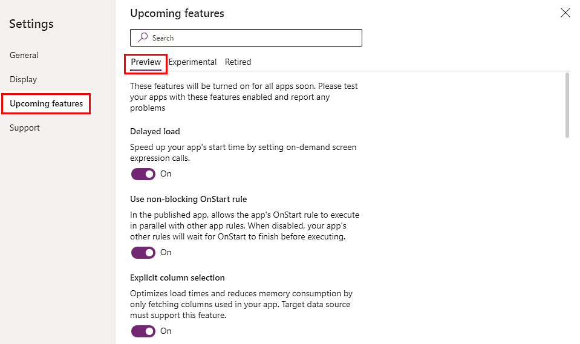

# Use Power Fx in AI Builder models in Power Apps (preview)

[!INCLUDE[cc-beta-prerelease-disclaimer](./includes/cc-beta-prerelease-disclaimer.md)]

Power Fx AI integration is a new approach that lets you reference AI models in any Power Apps control using the Power Fx formula language. If you've used [canvas apps](/powerapps/maker/canvas-apps/getting-started), you're already familiar with Power Fx. This is the same open-source low code formula language, only it's been updated so that you can customize your AI Builder models. For example, you can modify the language your text appears in.

To learn more, go to [Microsoft Power Fx overview](/power-platform/power-fx/overview).

> [!IMPORTANT]
> - This is a preview feature.
>
> - [!INCLUDE[cc_preview_features_definition](includes/cc-preview-features-definition.md)]

## Make sure the Power Fx feature is enabled

The Power Fx feature is enabled by default in Microsoft Power Apps. If it's been disabled and you want to enable it again, you can do this in the Canvas screen.

1. On the toolbar at the top, select **Settings**.

    > [!div class="mx-imgBorder"]
    > 

1. Select **Upcoming features** > **Preview**.

1. Enable all features by selecting **On**.

    > [!div class="mx-imgBorder"]
    > 

## Determine which AI model to use

AI Builder lets you customize many types of models. Link to Build page. You can also use custom models built in Microsoft Azure Machine Learning with the bring your own model feature.

## Open your model in Power Apps

1. Select **Data tab** > **Add data** > **AI Models**.

    > [!div class="mx-imgBorder"]
    > 

1. If you don’t see **AI Models** in the **Add Data** list, do the following:

    1. On the toolbar at the top, select **Settings**
    1. Select **Upcoming features** > **Preview**.
    1. Scroll to the bottom and make sure that **AI models as data sources** is **On**.

    > [!div class="mx-imgBorder"]
    > 

1. Select one or more models to add.

## How to reference a model

An AI model is just a function/method call *(BILL: I assume there’s some analogy you can draw from within Power Apps, but I don’t really know) with inputs and outputs.*

For a list of AI models, go to [AI models and business scenarios](model-types.md).

## Input/output variation

In this preview, every model is invoked using the *predict* verb. For example, a language detection model takes text as an input and returns a table of possible languages, ordered by that language’s score. The score says how likely the model thinks it is that the indicated language is correct.

|Input  |Output  |
|---------|---------|
|'Language detection (preview)'.Predict("Bonjour").results     | *Ask Caio Duarte Diniz Monteiro*        |

To return the most likely language:

|Input  |Output  |
|---------|---------|
|First('Language detection (preview)'.Predict("Bonjour").results).language  | "fr" (country code for French)       |
|
