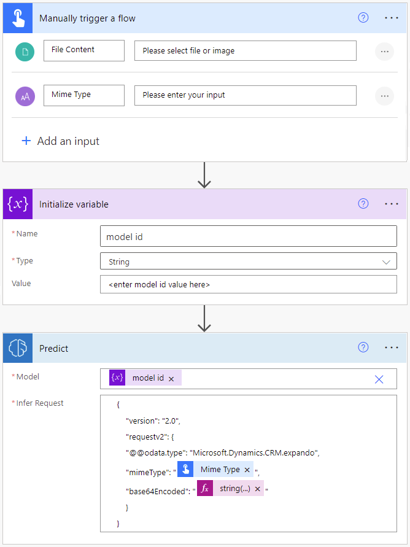
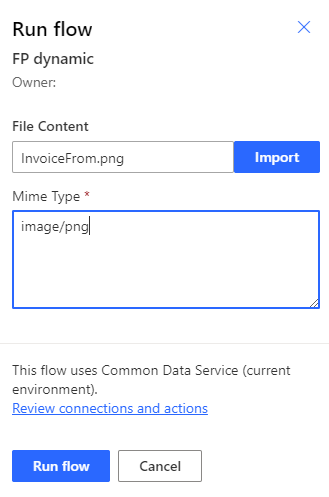
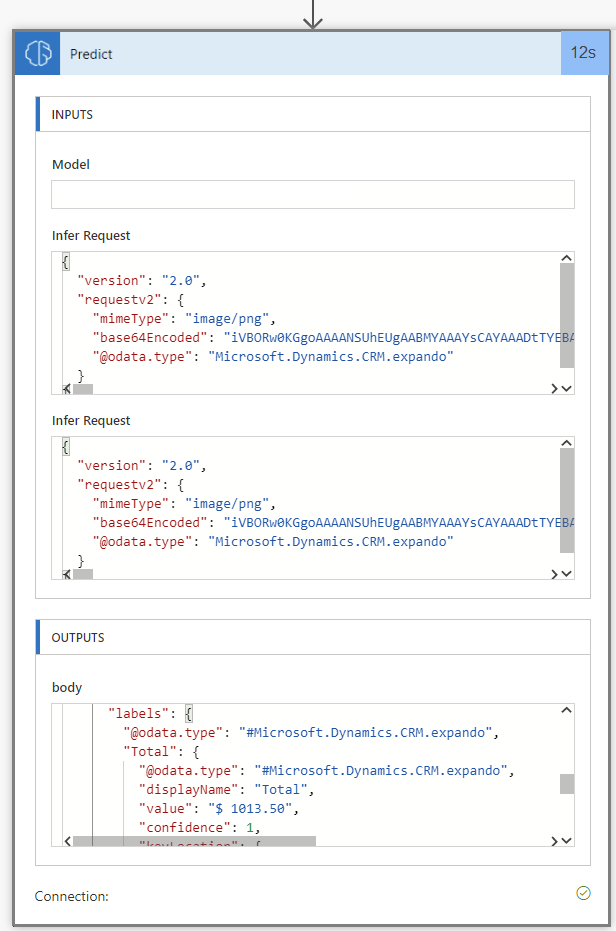

# Use the predict action in Power Automate

> [!IMPORTANT]
 > To use AI Builder models in Power Automate, you have to create the flow inside a solution. The steps below won't work if you don't follow these instructions first: [Create a flow in a solution](/flow/create-flow-solution).

You can use dedicated actions for each AI Builder model in Power Automate. However, the **Predict** action lets you use many AI Builder model types.

## Use a custom or prebuilt model

1. Sign in to [Power Automate](https://flow.microsoft.com/), select the **My flows** tab, and then select **New > +Instant-from blank**.
1. Name your flow, select **Manually trigger a flow** under **Choose how to trigger this flow**, and then select **Create**.
1. Select **+ New step**, search for **Predict** and select **Predict from AI Builder** or **Predict from Common Data Service**. Both actions offer the same features.

    > [!div class="mx-imgBorder"]
    > 

1. In the **Model** field, select a custom model you created or choose a prebuilt model. Here is the list of the prebuilt models available:
   - Business card reader: BusinessCard model
   - Category classification (prebuilt): CategoryClassification model
   - Entity extraction (prebuilt): EntityExtraction model 
   - Key phrase extraction: KeyPhraseExtraction model
   - Language detection: LanguageDetection model
   - Sentiment analysis: SentimentAnalysis model
   - Text recognition: TextRecognition model

>[!NOTE]
>
>To learn more about the input and output parameters of each model, refer to the documentation explaining how to use the selected model in the following documentation sections:
>- Use a custom AI Builder model in Power Automate
>- Use a prebuilt AI Builder model in Power Automate


## Use a dynamic model id (advanced usage)
For some complex use cases, you may need to pass a model id dynamically to the predict action. For example, if you want to process different type of invoices using multiple models, you may want to choose automatically a model depending on the type of invoice.

In this section, we'll explain you how to configure the AI Builder predict action for this specifc purpose depending on the model type.

1. Sign in to [Power Automate](https://flow.microsoft.com/), select the **My flows** tab, and then select **New > +Instant-from blank**.

1. Name your flow, select **Manually trigger a flow** under **Choose how to trigger this flow**, and then select **Create**.

1. Select **+ New step** and search for **Initialize variable**. Enter **Model id** as name, **String** as type, and the actual model id as value. 
The model id can be found in the URL of the model's detail page in Power Apps: *make.powerapps.com/environment/[environment id]/aibuilder/models/**[model id]*** 

1. Select **+ New step**, search for **Predict** and select **Predict from AI Builder**. Select **Enter custom value** and enter **Model id** form previous step.

The **Infer request** field value depends on the model type.

### Form processing model

1. In the step **Manually trigger a flow**, add a **File** input and set its name to **File Content**.
1. In the step **Manually trigger a flow**, add a **Text** input and set its name to **Mime Type**.
1. In the step **Initialize variable**, enter a form processing model id.
1. In the step **Predict**, enter following value in the **Infer request** field:

    ```json
        {
            "version": "2.0",
            "requestv2": {
            "@@odata.type": "Microsoft.Dynamics.CRM.expando",
            "mimeType": "@{triggerBody()['text']}",
            "base64Encoded": "@{string(triggerBody()?['file']?['contentBytes'])}"
            }
        }
    ```

    > [!div class="mx-imgBorder"]
    > 

5. Select **Save** in the upper-right corner, and then select **Test** to try out your flow:
    
    > [!div class="mx-imgBorder"]
    > 

6. In the flow run details, get the model JSON output in the **OUTPUTS** section of the predict action. This is useful to build downstreams actions using values of the model.

    > [!div class="mx-imgBorder"]
    > 

7. Go back to your flow in edit mode and select  **+ New step** and select the **Compose** action (or any other action to process your model output). Let's say your model output has the **Total** field, you can get it with the following formula:

    *@{outputs('Predict')?['body/responsev2/predictionOutput/labels/Total/value']}*

    > [!div class="mx-imgBorder"]
    > 


### Object detection model

Similar process with following infer request at step 4:

```json
{
    "version": "2.0",
    "requestv2": {
        "@@odata.type": "Microsoft.Dynamics.CRM.expando",
        "base64Encoded": "@{string(triggerBody()?['file']?['contentBytes'])}"
    }
}
```


### Category classification model

Similar process with following infer request at step 4:

```json
{
    "version": "2.0",
    "requestv2": {
        "@@odata.type": "Microsoft.Dynamics.CRM.expando",
        "language": "Detect automatically",
        "text": "The text to categorize"
    }
}
```
 
 
