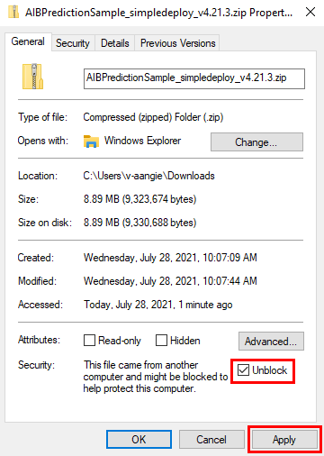
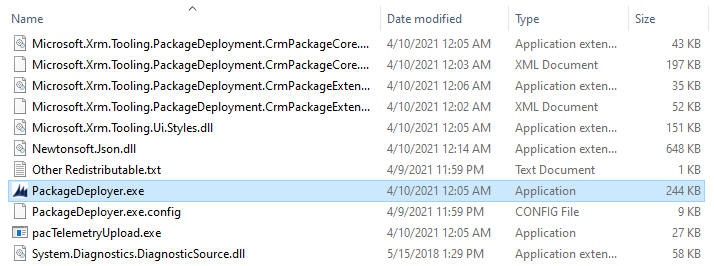
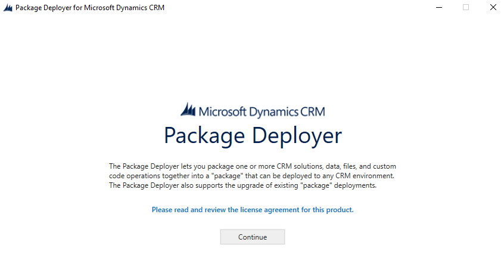
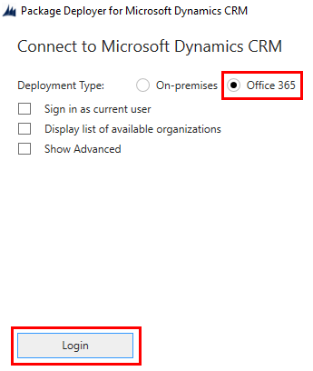
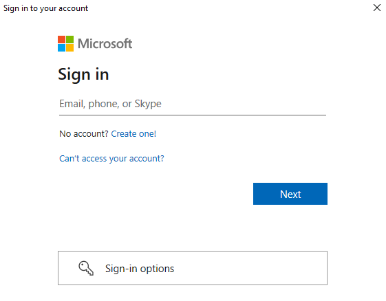
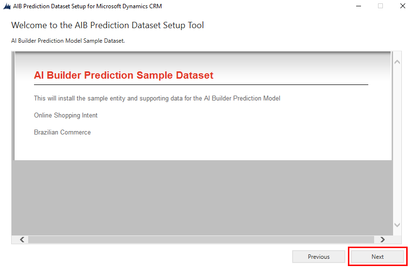
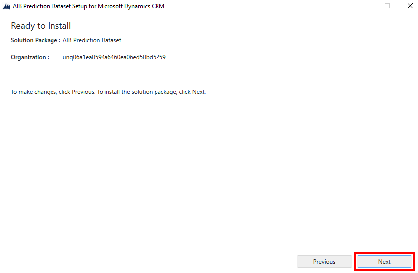
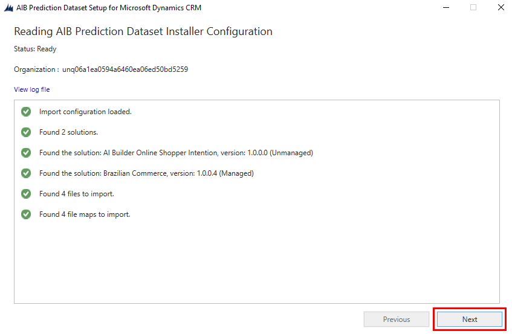
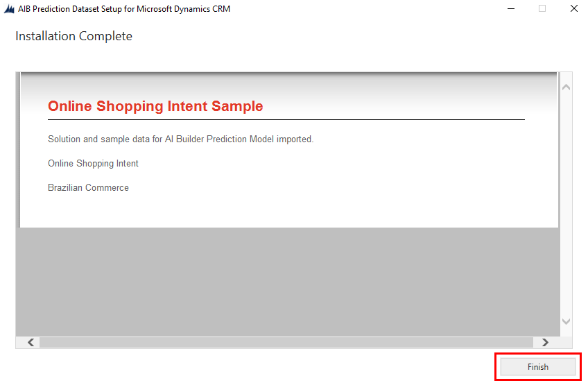

# Data preparation

Before you create your prediction model, you'll want to make sure your data is in Microsoft Dataverse and that it's in the correct format.

## Create your custom table

Do you have data that you want to import into Dataverse for training in AI Builder? First, you have to create a table. In this example, we'll provide a solution that has predefined custom tables. To use your own data, [create a custom table](/powerapps/maker/common-data-service/data-platform-create-entity) and use it<!--note from editor: Suggested.--> instead of the example used here.

> [!NOTE]
>For best results, use a dataset that is less than 1.5 GB in size. Otherwise, AI Builder will use only 1.5 GB of your data to train and predict. Because you can't control which data that exceeds the 1.5 GB limit won't be used, you should optimize your data to stay under 1.5 GB.

## Sample dataset for prediction model

1. Download the AI Builder sample dataset package: [AIBPredictionSample_simpledeploy_v4.21.3.zip](https://github.com/microsoft/PowerApps-Samples/blob/master/ai-builder/AIBPredictionSample_simpledeploy_v4.21.3.zip)

1. Ensure that the file isn't blocked after download. To do this:
   1. Locate the downloaded zip file, right-click, and then select **Properties**.
   1. Select the **Unblock** checkbox, and then select **Apply**.

   > [!div class="mx-imgBorder"]
   > 

1. Extract the .zip file, and look for **PackageDeployer.exe** in the extracted folder.

   > [!div class="mx-imgBorder"]
   > 

1. Run **PackageDeployer.exe**. A screen similar to the following image will appear.<!--note from editor: This image looks funny, should it maybe be updated? Or is it okay it doesn't refer to Dynamics 365?-->

   > [!div class="mx-imgBorder"]
   > 

1. Select **Continue**.

1. Select **Office 365**,<!--note from editor: As above, is this what a user will currently see or should the screenshot be updated to Microsoft 365?--> and then select **Login**.<!--note from editor: Angle brackets are good for "simple sequences of menu interactions," but I don't think this one works. -->

   > [!div class="mx-imgBorder"]
   > 

1. Enter the credentials that you use to sign in to the Power Apps maker portal, and then select **Next**.

   > [!div class="mx-imgBorder"]
   > 

1. If the sign-in is successful, you'll see the Welcome screen. Read the message, and then select **Next**.

   > [!div class="mx-imgBorder"]
   > 

1. On the **Ready to Install** screen, make sure you're installing the solution in the correct environment and then select **Next**.

   > [!div class="mx-imgBorder"]
   > 

1. In the **Reading AIB Prediction Dataset Installer Configuration** screen, read the summary information for the data and solutions being imported and then select **Next**.

   It will take a few minutes to import the data. As each step is completed successfully, you'll see a green circle with a check mark next to the step.  

   > [!div class="mx-imgBorder"]
   > 

1. On the **Installation Complete** screen, select **Finish**.

   > [!div class="mx-imgBorder"]
   > 

## How you can use the solutions you installed

The sample dataset installs two solutions in your environment. It also installs sample data for the included entities:

- **Brazilian Commerce:** Use for predicting multiple outcomes. Select **BC Orders** as the table, and **Delivery Timeliness** as the column when you pick what do you want to predict.

- **AI Builder Online Shopper Intention:** Use for binary prediction and numerical prediction.
   - Select **Online Shopper Intentions** as the table, and **Revenue (Label)** as the column if you want to try out binary prediction.
   - Select **Online Shopper Intentions** as the table. Also select **ExitRates** or **BounceRates** as the column if you want to try out numerical prediction.

If you need help with creating a prediction model, follow the instructions in [Create a prediction model](prediction-create-model.md).

> [!div class="mx-imgBorder"]
> 

You're now ready to go to the next step.

### Next step

[Create a prediction model](prediction-create-model.md)

[!INCLUDE[footer-include](includes/footer-banner.md)]
