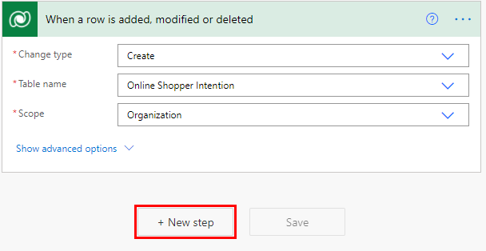

# Use a prediction model in Power Automate

1. Sign in to [Power Automate](https://flow.microsoft.com/).

1. Select **My flows** in the left pane, and then select **New flow** > **Automated cloud flow**.

1. Name your flow, and then select **Skip**. Instead of using this screen, you'll select you flow's trigger in the next step by filtering a list.

1. Select **Microsoft Dataverse**, and then select **When a row is added, modified, or deleted**.

1. Configure the trigger, select **Show advanced options** (**Show** is replaced with **Hide**), and then add any additional steps to prepare data.

    > [!div class="mx-imgBorder"]
    > 

<!--DEON: Can't save. What configs need to be fixed? See TIP screen.-->

1. Add the **Predict** action in a new step.

1. Complete the fields using your data, or data from previous steps in the flow.

1. Update the row by using prediction output.

Congratulations! You've created a flow that uses the real-time prediction feature in AI Builder. Select **Save** on the top right, and then select **Test** to try out your flow.

### See also

[Use your prediction model](prediction-use.md)  
[Train your model in AI Builder](train-model.md)  
[Publish your model in AI Builder](publish-model.md)

[!INCLUDE[footer-include](includes/footer-banner.md)]