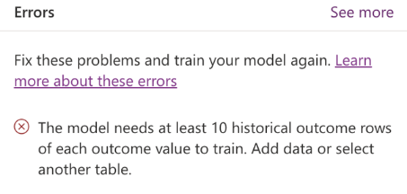

# Prediction model training errors and warnings

While training the prediction model, you might come across the messages in this article that may be reported by AI builder. Messages are either *errors* or *warnings*. Each is represented by an icon.

|Message |Icon  |
|---------|---------|
|Error   |         |
|Warning | 

 When an error occurs, you can't continue until you resolve it. If the system doesn't know how to correct a problem, it will show you an error.

Warnings are messages reported as informational and don't stop you from proceeding ahead. They warn you of possible performance issues when training the model.

> [!div class="mx-imgBorder"]
> 

## Error: No AI Builder license

*You need an AI Builder license to use this feature. Start or extend a trial or contact your admin to upgrade.*

### Cause

You either don't have an active AI Builder license, or the existing trial has expired.

### Resolution

To use AI Builder models, make sure you have the AI Builder license assigned.

## Error: Insufficient number of rows to train

*The model needs at least 50 rows to train. \<TableName> has only \<ActualValue> rows. Add data or select another table.*

> [!div class="mx-imgBorder"]
> 

### Cause 

The table that you've selected as the historical outcome doesn't have enough rows in it for the model to train itself to predict future outcomes.

### Resolution

Add a minimum of 50 rows to the table. Use a minimum of 1,000 rows for better prediction results. More information: [Prediction model prerequisites](prediction-prereq.md)

## Error: Insufficient historical outcome rows to train

*The model needs at least 10 historical outcome rows of each outcome value to train. Add data or select another table.*

> [!div class="mx-imgBorder"]
> 

### Cause

The column that you selected to let AI Builder study the historical outcome doesn't have enough rows for each possible outcome. For example, in a Boolean field where the possible outcomes can be either true or false, there should be a minimum 10 rows of historical data where the outcome is set to **True** and another 10 rows set to **False**.

### Resolution

Make sure you have 10 rows of each possible outcome value that you would like the model to predict. More information: [Prediction model prerequisites](prediction-prereq.md)

## Warning: Add data to improve model performance

*The model might produce better performance with optimum rows of 1,000 or more to train the model. Online Shopper Intention has \<Actualcount> rows. Add data for better model performance.*

> [!div class="mx-imgBorder"]
> 

### Cause

The AI model found that the number of rows might not result in optimal model performance.

### Resolution

We recommend 1,000 rows or more of historical data with outcomes to predict outcomes with a high level of accuracy. However, 50 rows is the minimum limit to process the prediction model.

## Warning: Column might be dropped from training model

*\<TableName>.\<AttributeName> might get dropped from training as it has a single value and does not contribute to training the model.*

> [!div class="mx-imgBorder"]
> 

### Cause

The AI model processes data in the columns related to the outcome that will influence the prediction. Of the various columns selected, it found that the specified column had only a single value across all rows in the table. Because of this, it won't impact the prediction and won't help training the model.

### Resolution

Make sure that all columns selected as being related to the outcome column have multiple values in the column. This will help with the training of the model.

## Warning: High ratio of missing values

*\<TableName>.\<AttributeName> has a high ratio of missing values, greater than <ThresholdValue> percentage and might not contribute to train the model.*

### Cause

The AI model processes the data in the columns related to the outcome that will influence the prediction. Of the various columns selected, the model found that the specified column had data in few rows in the table. Since the data won't impact the prediction, it won't help training the model.

### Resolution

Make sure the columns that are selected as being related to the outcome have data for them across most of the rows in historical data.

## Warning: High percent correlation to the outcome column

*\<TableName>.\<AttributeName> has \<ThresholdValue> percent correlation \<CorrelationName> with \<OutcomeAttributeName> and model might suspect to cause target leak.*

### Cause

The AI model processes the data in the columns related to the outcome that will influence the prediction. Of the various columns selected, it found that the specified column has a high correlation with the outcome column, which might impact the prediction result. Because if this, it won't be included in training the model.

*Target leakage* is when you train your model on a dataset that includes information that wouldn't be available at the time of prediction. This might result in unrealistic data.

### Resolution

Make sure the columns selected as being related to the outcome don't have a high correlation with the outcome column for a fair prediction.

### See also

[Common issues and resolutions for AI Builder](common-issues.md)

[!INCLUDE[footer-include](includes/footer-banner.md)]