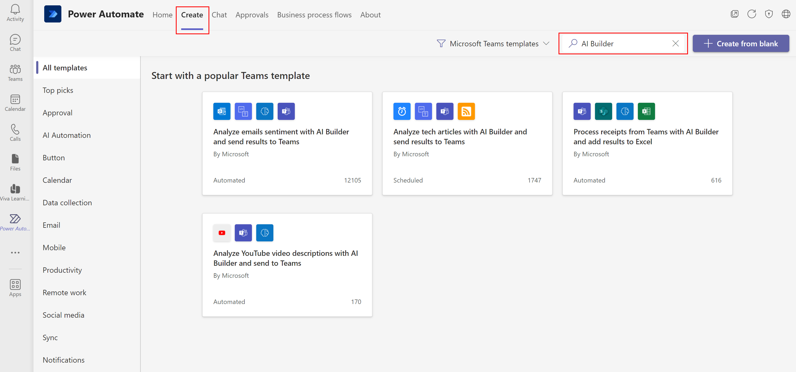
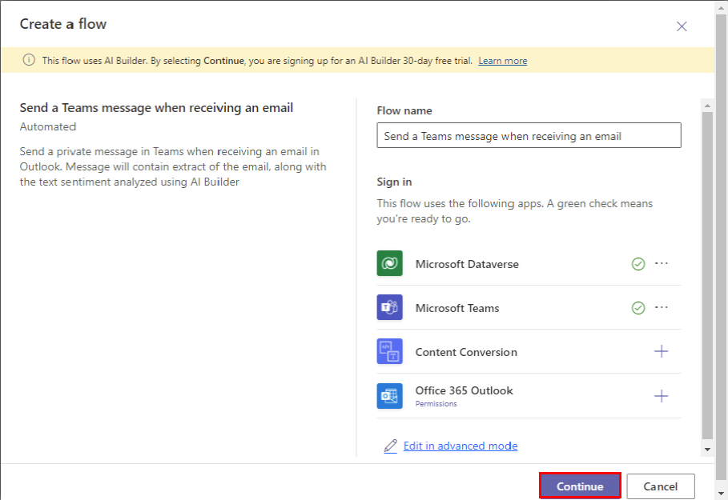

# Use AI Builder in Teams

You can use Power Automate templates in Teams that solve a specific business purpose using AI Builder actions.

## Discover AI Builder templates in Teams

1. Go to your Teams app or [Teams web](https://teams.microsoft.com).

3. Select the **Apps** icon on the bottom left.

5. Look for the app named **Power Automate** and install it. The app appears on the left menu of Teams.

   You can pin the app to keep it there when you reopen Teams.

3. Select the Power Automate app, and then select the **Create** tab.

   From there you can search for the AI Builder templates listed in the next section in this article.
    
> [!div class="mx-imgBorder"]
> 

## Create a flow from a template
From the list of AI Builder templates, choose the one that fits the most to your need. If you don't have [Microsoft Dataverse](https://docs.microsoft.com/powerapps/maker/data-platform/data-platform-intro), you will see the following dialog:

> [!div class="mx-imgBorder"]
> 

When selecting the **Continue** button, Dataverse will be installed. It usually takes a couple of minutes (in some cases it can take more than 1 hour) and has to be done only once.

If Dataveserse is already installed, you will land on the simplified template experience for Teams. The first screen asks you to validate connections:
 
> [!div class="mx-imgBorder"]
> 

>[!NOTE]
>
>An AI Builder trial will be started or extended if needed. This action will be performed silently upon selecting the **Continue** button.

Once all your connections are valid, you can select **Continue**.

This is now the time for you to enter the parameters required by the template to create the flow:

 > [!div class="mx-imgBorder"]
 > 

>[!NOTE]
>
>It's also possible to select "Edit in advanced mode". This will open the full flow editor within Teams. 

Once you filled all the parameters, your can select **Create flow**. After few seconds, your flow will be created and ready to use.

Created flows are visible and can be modified from the home page of the Power Automate application.

### See also

[Use flows in Microsoft Teams](https://docs.microsoft.com/power-automate/teams/overview)

