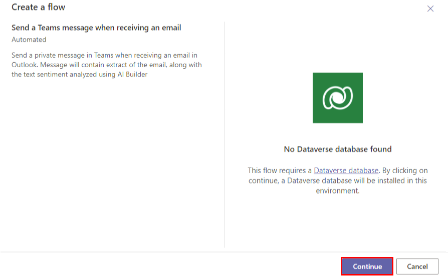
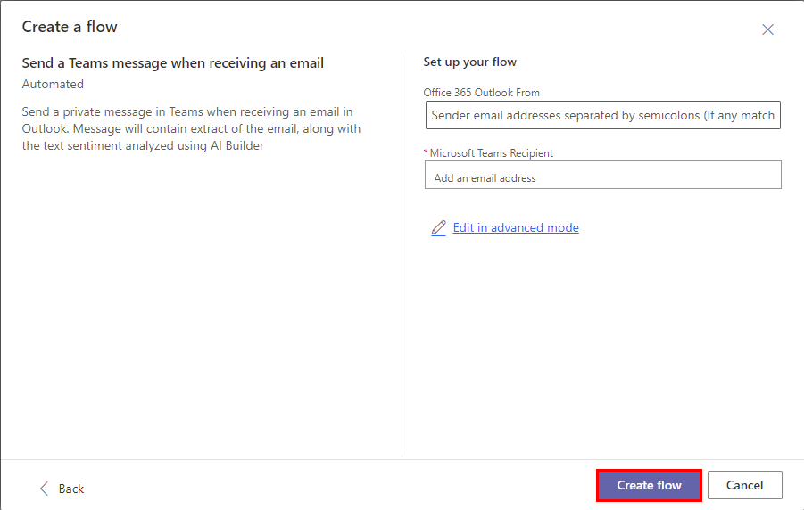

# Use AI Builder in Teams

You can use Power Automate templates in Teams that solve a specific business purpose using AI Builder actions.

## Discover AI Builder templates in Teams

1. Go to your Teams app or [Teams web](https://teams.microsoft.com).

1. Select the **Apps** icon on the bottom left.

1. Search for **Power Automate** and install it. The app appears in the left panel in Teams.

   You can pin the app to keep it there when you reopen Teams.

1. Select the Power Automate app, and then select the **Create** tab.

   From there you can search for the AI Builder templates listed in the next section in this article.

   > [!div class="mx-imgBorder"]
   > 

## Create a flow from a template

1. From the list of AI Builder templates, choose the one that fits your needs the most. 

    - If you don't have [Dataverse environment with database](/power-platform/admin/create-environment#create-an-environment-with-a-database), you will see the following dialog. Select **Continue** to add a database. It usually takes a couple of minutes (in some cases it can take more than 1 hour) and has to be done only once.

        > [!div class="mx-imgBorder"]
        > 

    - If you already have a Dataverse environment with database, you will land on the simplified template experience for Teams. The first screen asks you to validate connections.

1. Once your connections are valid, select **Continue**.

   > [!NOTE]
   > An AI Builder trial will be started or extended if needed. This action will be performed silently upon selecting **Continue**.

   > [!div class="mx-imgBorder"]
   > 

1. Enter the parameters required by the template to create the flow.

   > [!NOTE]
   > It's also possible to select **Edit in advanced mode**. This will open the full flow editor within Teams. 

1. Once you filled all the parameters, select **Create flow**. After few seconds, your flow will be created and ready to use.

   > [!div class="mx-imgBorder"]
   > 

Created flows are visible and can be modified from the Power Automate home page. 

### See also

[Use flows in Microsoft Teams](/power-automate/teams/overview)
