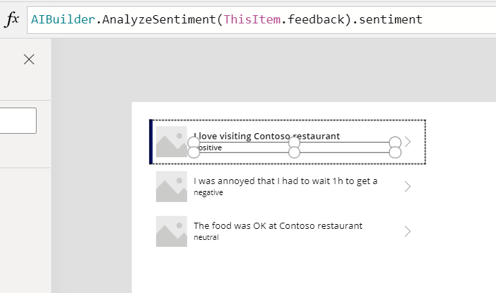

# Use your AI model

After you publish your model, you can use it across Microsoft Power Platform to create end-to-end solutions that meet your business needs. In this topic, you'll learn all of the different ways you can use your model.

After you publish your model, a **Use model** button appears in the **Performance** section. This opens a pane that shows all the ways you can use your model. These options vary based on your AI model type.

## Set a run schedule

Create a schedule to generate predictions regularly in Common Data Service. To view the scheduling options available for your model type, see [Set a run schedule for your category classification model](text-classification-model-use-tags.md#set-run-schedule-on-common-data-service).

## Run now

Generate new predictions right away and save them to Common Data Service. To learn how to run your model immediately<!--I couldn't find anything that talked about the **Run now** command for different model types.-->, see [Run your prediction model](prediction-use.md#prediction-run).<!--Edit okay? The original [link]() didn't seem to be right.-->

## Create a new app

Insert an AI Builder component into a canvas app. More information: [AI Builder in Power Apps overview](use-in-powerapps-overview.md)

<a name="use-formulas-for-text-ai-models"></a>

## Use formulas for text AI models (preview)

You can integrate some AI Builder models in [Power Apps Studio](https://create.powerapps.com) by using the formula bar. Currently, this functionality is available only for the following AI Builder model types:

* Sentiment analysis
* Entity extraction
* Key phrase extraction
* Language detection
* Category classification

For information about when this functionality might become available with other model types, see [What's new and planned for AI Builder](/power-platform-release-plan/2019wave2/ai-builder/planned-features).

 > [!IMPORTANT]
 >* This is a preview feature. [!INCLUDE [cc-preview-features-definition](includes/cc-preview-features-definition.md)]
 >* [Data loss prevention policies](/power-platform/admin/wp-data-loss-prevention) that apply to Common Data Service also apply to AI Builder.
 >* To use formulas in an app that was created before May 7, 2020, go to **Settings** > **Advance Settings** > **Preview Features**, and set **AI Builder formulas** to **ON**. This step isn't necessary for newly created apps.

To enable or disable this feature (for example, for data loss prevention), see **AI Builder formulas** under **Advanced Settings**. More information: [Controlling which features are enabled](/powerapps/maker/canvas-apps/working-with-experimental-preview#controlling-which-features-are-enabled)

When you enter **AIBuilder** in an app, it might take a few seconds to load its functions. After it loads, enter a period (**.**) to view the available functions. For detailed information about how to use formulas in canvas apps, see [Get started with canvas-app formulas in Power Apps](/powerapps/maker/canvas-apps/working-with-formulas).

### Example: Sentiment analysis

In this example, we use a **Text Input** control and a **Label** control to invoke sentiment analysis.

1. Sign in to [Power Apps Studio](https://create.powerapps.com).

1. Insert a **Text Input** control, select it, select **Advanced Properties**, and then set **DelayOutput** to true. The **Text Input** in this case contains the text we want to analyze.

1. Insert a **Label** control, and then enter the AI Builder formula `AIBuilder.AnalyzeSentiment(TextInput1).sentiment` as shown in the image below<!--We don't want the image to carry any information that isn't also available in text.-->. The results of sentiment analysis will automatically appear in the **Label** control after you apply the AI Builder formula.

    > [!div class="mx-imgBorder"]
    > 

1. If you want, you can select the **Label** control, enter **AIBuilder**, and try out the various formulas, using **TextInput1** as the text.

    > [!div class="mx-imgBorder"]
    > 

### Available formulas

|Formula|Description|
|:-----|:-----|
AIBuilder.AnalyzeSentiment(TextInput1).sentiment|Returns the sentiment of the text, such as negative or positive.
Concat(AIBuilder.CategorizeText (TextInput1).categories , type & ",")|Returns all categories that belong to the text, in list form.
Concat(AIBuilder.CategorizeText(TextInput1, { modelId: GUID("\<yourModelId\>").categories, type & ",")|Uses your custom AI Builder model to return all categories that belong to the text, in list form.
AIBuilder.DetectLanguage(TextInput1).language|Returns the two-letter language code (ISO 3166) of the text.
Concat(AIBuilder.ExtractKeyPhrases(TextInput1).phrases, phrase & ",")|Extracts all key phrases from the text into a list.
Concat(AIBuilder.ExtractTextEntities(TextInput1).entities, type & ", ")|Extracts the types of entities present in the text into a list.

### Supported languages

The AnalyzeSentiment, CategorizeText, ExtractKeyPhrases, and ExtractTextEntities formulas all support multiple languages. With the DetectLanguage formula, you can specify a country to narrow the languages that are included.

|     Formula                          |     Example                                                                                                                   |     Languages   |
|--------------------------------------|-------------------------------------------------------------------------------------------------------------------------------|------------------------------|
|     AIBuilder.AnalyzeSentiment       |     AIBuilder.AnalyzeSentiment(“Esta   fiesta es mi favorita”, { language: “es-ES”}).sentiment                                |     [Link](https://docs.microsoft.com/azure/cognitive-services/text-analytics/language-support?tabs=sentiment-analysis)                     |
|     AIBuilder.CategorizeText         |     Concat(AIBuilder.CategorizeText(“Esta   fiesta es mi favorita”, { language: “es-ES”}).categories, type & “,”)             |     [Link](https://docs.microsoft.com/ai-builder/prebuilt-category-classification)                     |
|     AIBuilder.ExtractKeyPhrases      |     Concat(AIBuilder.ExtractKeyPhrases(“Esta   fiesta es mi favorita”, { language: “es-ES”}).phrases, phrase & “,”)           |     [Link](https://docs.microsoft.com/azure/cognitive-services/text-analytics/language-support?tabs=key-phrase-extraction)                     |
|     AIBuilder.ExtractTextEntities    |     Concat(AIBuilder.ExtractTextEntities(“Esta   fiesta es mi favorita”, { language: “es-ES”}).entities, type & “,”)          |     [Link](https://docs.microsoft.com/ai-builder/prebuilt-entity-extraction)                     |
|     AIBuilder.DetectLanguage         |     AIBuilder.DetectLanguage("I   love seattle", {countryHint:"AU"}).language                                                 |     [Link](https://docs.microsoft.com/azure/cognitive-services/text-analytics/language-support?tabs=language-detection)                     |

### Example: Use formulas in a gallery control

Some AI models, like key phrase or entity extraction, return more than one result. You can use a gallery control to display the results from this type of AI Builder model.

1. Insert a gallery control into your canvas app.

1. To populate the gallery with sample text: ensure the gallery control is selected, copy the following text, and then paste it into the gallery control.

   ```
   Table({feedback: "I love visiting Contoso restaurant"}, {feedback: "I was annoyed that I had to wait 1h to get a table at Contoso restaurant"}, {feedback: "The food was OK at Contoso restaurant"})
   ```

1. Select the label control in the gallery control, and then enter the formula `AIBuilder.AnalyzeSentiment(ThisItem.feedback).sentiment` as shown in the following image:

    > [!div class="mx-imgBorder"]
    > 

### Next step

[Share your AI model](share-model.md)

### See also

[AI Builder in Power Automate overview](use-in-flow-overview.md) <br>
[AI Builder in Power Apps overview](use-in-powerapps-overview.md)
